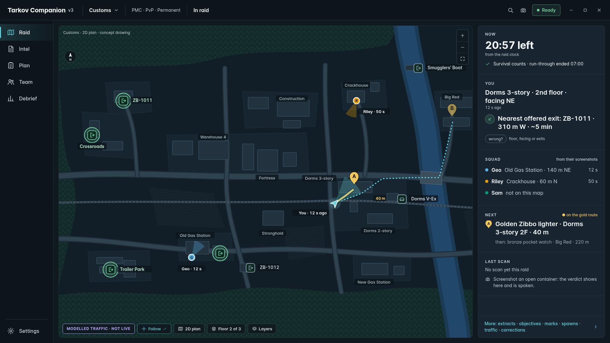

# Tarkov Companion

A second-screen companion for Escape from Tarkov. It watches the files the game already writes
and turns them into a live map, a raid record, and answers about items, ammunition, keys,
quests, the hideout and the flea market.

**External and read-only toward the game.** It does not read game memory, inject code, hook
rendering, inspect traffic, generate input, or draw over the game window. Everything it knows
comes from two ordinary folders: the game's logs, and the screenshots you take yourself.

That boundary is about not interfering with the game. [`docs/SAFETY.md`](docs/SAFETY.md) writes
it out, and `scripts/audit-safety.sh` enforces it on every build.

## Install

The V2 app ships as rough test builds. Once installed, it updates itself from the rough update
channel. It checks shortly after launch and every few hours. When a build is waiting, a notice
says so, and **Restart** installs it in place. Program and data live in separate folders, so an
update never touches your raids, profile or settings. The
[releases page](https://github.com/smartpbx/tarkov-companion/releases) carries the older builds.

The rough channel checks the SHA256 of every download before it installs anything. It does not
check who published the build; there is no signature yet. The installer is unsigned too, so
Windows SmartScreen warns the first time. The signed release ring that replaces it is
[#280](https://github.com/smartpbx/tarkov-companion/issues/280), and
[docs/RELEASES.md](docs/RELEASES.md#the-rough-channel) says exactly what the rough channel proves
and what it does not.

If a build misbehaves, **Setup › Updates & Diagnostics › Go back to the previous version** reinstalls the one
before it, checks its hash, and stays there until something newer is published.

Text recognition prefers the recogniser built into Windows, which needs nothing installed. It
falls back to Tesseract, and *that* needs the
[Microsoft Visual C++ 2015-2022 x64 runtime](https://aka.ms/vs/17/release/vc_redist.x64.exe).
Most people never need it, and Setup says which recogniser is actually running.

A new install needs no setup. It looks for the game's logs and screenshots on every fixed drive,
in Steam libraries and under OneDrive. Until logs, screenshots and game data are all found, the
Raid page shows one slim line saying which one is missing, with a button to fix it. Once all
three are found the line goes away.

## Finding your way around

A rail on the left holds six workspaces:

- **Raid**: the map, your extracts, and the squad, during a raid.
- **Intel**: items, ammunition, keys, the flea market, crafts, your stash and Loot Scan results.
- **Plan**: quests, loadout, hideout and events, before a raid.
- **Team**: the squad, what you share with it, and paired tablets.
- **Debrief**: the raids you have played, and what they earned.
- **Setup**: folders, updates, appearance, language, data and privacy.

**Ctrl+K** opens a palette that runs commands, finds any setting by name, and answers questions
(see [Ask](#knowing-things)).

The V1 interface is still inside the build for anyone who needs it. Start the app with
`--ui-shell legacy`.

## What it does

### The map

- Every map from tarkov.dev, in photographic tiles or the hand-drawn plan where a map publishes
  both, chosen per map and remembered.
- **Your position and heading**, read from the filename of a screenshot you took. The game
  writes both into the name; nothing is captured and nothing is tracked.
- **Where you have been**, as a dotted trail. **Follow** moves the map to you when a new
  screenshot lands, at a zoom you choose.
- **The floor you are standing on**, chosen from your height, without you asking.
- **Four modes.** Navigate moves the map. Inspect says what is at the point you click: extracts,
  spawns, objectives and loot nearby, with distance. Route builds a plan stop by stop. Draw puts
  lines on the map, in thin, medium or thick, for yourself or for the squad.
- **Layers**, grouped under You, Squad, Routes, Quests, Map, Marks & drawings, Loot and Traffic.
  Every row can always be switched back on, and each one stays as you left it across raids,
  maps and restarts. **Loot focus** hides everything but loot and the essentials, and a second
  press brings the rest back.
- **A loot layer with a value threshold** (per item or per slot) on its own Layers row, so only
  spawns worth the walk are drawn. It shows known potential spawns from tarkov.dev, not what is
  in the raid.
- **Nearby spawns and spawn lines**, for the first five minutes of a PMC raid: the spawn areas
  within a radius you set per map, and a dashed line from each to you, captioned "possible PMC
  spawn". They are modelled from the catalog's spawn points, never a detected player.
- **Place names** that never overlap each other or a marker, give way by importance as you zoom
  out, and read in English where the sign is a generic Russian word.
- **2D and Stack.** Stack shows the floors as plates, switching to the drawn plan where a map
  needs it. 3D is not available: no map publishes an interior model.
- **Only your extracts.** The list follows your raid side, PMC or Scav, and hides the others,
  because a door that will not open is worse than no marker at all. Scav, PMC and shared differ
  in both colour and shape, because colour alone fails at twelve pixels and for a colourblind
  player.
- **What an exit asks of you.** Each extract lists its requirements. Where a switch has to be
  thrown first, it shows the chain in order, and what it costs.
- **Quest objectives**, as lettered pins, and a gold route through the ones on this map.
  **On it** in Plan puts a quest on the Raid map. The route, the direct line and the suggested
  extract route are each one saved switch. **My trail** shows your past trails on this map; it
  is off by default.

### The raid

- Reads the game's own logs to follow the raid: matching, loading, in raid, over. Scav or PMC.
  Survives the companion being started mid-raid. When the game changes mode (PvP, PvE, Seasonal),
  the active profile follows it, says so on one line, and offers Undo.
- A raid clock, from a screenshot of the extract list, from the raid start, or set by hand. It
  says which.
- **The Now panel** replaces the Raid page's stack of cards with five short blocks: **NOW** (the
  one clock and the raid's phase), **YOU** (area, floor, facing and the nearest offered exit,
  from your last screenshot), **SQUAD**, **NEXT** (the next objective on your route) and **LAST
  SCAN**. It never scrolls, every guess is labelled, and every change of phase says why. The
  cards are one tap away under More. In the last ten minutes it adds "Leave for *exit* by
  *time*", an estimate from your last screenshot and your walking pace, with a margin you set.
- **A pre-raid brief** while you match and load: the map and raid length, possible bosses with
  the catalog's spawn chance, your quests on that map and what they need, your side's extracts
  and their requirements, and the squad's state.
- **Quests mark themselves.** The game announces every quest starting, failing and being handed
  in, and those are recorded as they happen. Nothing is inferred and nothing you recorded by
  hand is overwritten.
- **Sound**, off by default: a tone at five minutes left and at zero, for a squadmate's mark,
  when a loot scan finishes, and when the app asks how a raid ended. Loot verdicts can be spoken
  ("Keep: LEDX"). It plays through Windows only and never listens to anything.

The Now panel and the pre-raid brief are behind the `now-panel` and `preraid-brief` feature
flags, on for the rough channel and switchable in Setup.

### Scanning

- Press the game's own screenshot key. That is the whole interface, and there is nothing to arm
  first. Every screenshot goes to every detector (containers, stash pages, items, the flea
  market, quest lists, extract lists), and the one that is sure of it reads it; the filename
  gives your position. The Now panel says which detector placed it and how sure it was. A frame
  none of them could place is listed under **Not recognised**, where **Read as…** reads it again.
- **Loot Scan.** Screenshot an opened container in raid, with your own grid visible. It names
  what it recognises and says take, swap or leave, with the reason. Items appear as they are
  read. Measured on real frames, the first scan of a session takes about a second and later ones
  a third of a second or less ([docs/PERFORMANCE.md](docs/PERFORMANCE.md)). Uncertain cells stay
  visible and are never promoted into a take.
- **Stash scan.** Scroll through your stash and screenshot each page. The pages are stitched into
  one stash, and owned counts feed Ammo, Keys and Loadout. Ammo and key cases get a guided scan of
  their own ([docs/STASH_SCAN.md](docs/STASH_SCAN.md)).
- **It learns from your corrections.** Where a cell, a stash tile or a flea name is not certain,
  **It is:** offers the likely items. Your pick is applied, kept with that screenshot, and
  remembered as a reference for next time. A learned reference is only used where the catalog's
  own art found nothing, so it can never change a name the catalog gave. Setup › Game & Capture
  shows what was learned and can delete it.
- **Quests from a TASKS screenshot.** An empty profile can start from screenshots of the game's
  quest list. Later screenshots offer a sync that applies nothing until you confirm it.
- Local text recognition, on your machine. No picture is uploaded, and none is kept unless you
  turn on Debug Capture. Each result says whether its image was kept.
- It finds the game's screenshot and log folders wherever they are, OneDrive or not. Where it
  cannot, Setup takes the path and shows what it is watching.
- Optional: screenshots older than the age you choose go to the recycle bin. Off until you turn
  it on in Setup › Game & Capture. Only files the game named are touched, and nothing is deleted
  outright.

Recognition is honest about its limits: item identity on real loot is still being measured and
improved ([#273](https://github.com/smartpbx/tarkov-companion/issues/273)). A HEALTH screen is
recognised but not read, and the trader, hideout, gear, messenger and post-raid screens are not
read yet either. [docs/RECOGNITION.md](docs/RECOGNITION.md) and
[docs/LOOT_SCAN.md](docs/LOOT_SCAN.md) have the numbers.

### Knowing things

Item values and flea prices with local history, ammunition by what it actually penetrates, keys
and what they open, quest progress and what is available now, hideout requirements, crafts, and
loadout checks. Ammo, Keys and Loadout show what you own.

The flea market says **when its offers were seen**, gives its reasons in plain words, and works
out the flea fee from the catalog. The best sale names the flea or a trader.

Seasonal events, where a consumable is safe for some players and not others, are kept locally,
because no feed publishes them. You name an event, search for what it applies to, and mark each
item Safe or Allergic as you test it. Nothing about that is observed from the game.

**Ask.** Type a question after Ctrl+K and it is answered from the app's own data, with the source
of each fact: "what do I need for Gunsmith 5", "where is Dorms 314 key used", where to get an
item, "best extract from here", "best 5.45 for class 4". Anything outside that says it cannot
answer and suggests the closest names. Nothing is sent anywhere.

**Plan** also holds a session plan ("You said 2 h"), raids in order, labelled an estimate and
redone after each raid, and **Hand in** reminders for quests whose objectives are all done.

The game writes its own player's level nowhere, so you type it on Plan. Its logs carry a level
on two thousand lines and every one belongs to somebody else.

### Debrief

When a raid ends, Debrief asks once how it ended (Survived, Died, Ran through, MIA, or Later),
because the log never says. Beside it, a recap of that raid names the source of every fact:
observed, inferred, estimated or entered by you. An unanswered raid reads "Outcome not recorded".

Every raid you played, with its map, side, outcome, the extract used and what it earned. Filter
by game mode and wipe, so PvE and last wipe stay out of this wipe's numbers. Per-map coverage,
charts with a table beside each one, tags, notes, saved views, and archive and restore. A Loot
Scan that was wrong can be marked wrong. For each map, one line sums up your own last five
raids there (deaths, where they happened, how many got out), your usual exit and your measured
walking pace. It comes from your own raid history only and predicts nothing.

### Playing together

An opt-in group relay. Turn it on, type one group key, and your squad sees each other on one
map: position, heading, map, raid state, and their loadout and quests if they share them.

- Everyone has a colour of their own, the same on the map and in the list beside it.
- **Marks.** Right-click to ping, a "look here" that fades. Hold Shift for a waypoint that stays
  until somebody clears it. Each mark has a colour, a scope (just me, or the squad) and a lifetime (a ping, 5 or 15 minutes, this raid,
  or until removed). Marks made while the relay is away are queued and sent when it comes back.
- **SQUAD rows.** On the Now panel each squadmate's row shows their area, distance, direction
  and age. A tap pings their last shared spot and a hold places a waypoint there. A new ping
  from them lights their row and the edge of the map toward it.
- **Ready check.** Each member sets Ready, and Team counts them. With **My ready check** on
  (the default), each member's own Loadout check for the planned map is shared too, so Team ›
  Squad counts who is ready and names what anyone is missing. You can also share your chosen
  extract and a short note.
- **Squad quests.** Share your open objectives, by id. Team › Squad lists the quests two or more
  of you hold on the planned map, in a suggested order, and **Put on the Raid map** routes them.
  Raid and Plan show the overlap too.
- **Clock correction.** A PC clock that is minutes out would make every age wrong. The relay
  measures the difference and the companion corrects for it, and says so on Team.
- One reusable key is both which group you are in and proof you belong. The relay receives that
  key before hashing it for room storage, so transport hardening and scoped credentials remain
  open work in [#304](https://github.com/smartpbx/tarkov-companion/issues/304) and
  [#310](https://github.com/smartpbx/tarkov-companion/issues/310).
- While it is on, your companion also sends the kit, level, side and scav timer your game logged
  for the rest of your in-game party, and the relay passes them to everyone holding the room
  key. That is how a group shows you the kit your own game never tells you, and it is an open
  conflict with [`docs/SAFETY.md`](docs/SAFETY.md) owned by
  [#310](https://github.com/smartpbx/tarkov-companion/issues/310).
- Nothing is sent while it is off, and you stop publishing your position when your raid ends.
  Live positions are held in memory only. On disk the relay keeps the group's waypoints, the
  rooms its operator registered, problem reports as sent, and its updater's status.

### The tablet

Pair a tablet or phone from **Team › Devices**. It opens the relay's page in a browser and
follows the desktop's raid map: where everybody is, the group's marks, and the ability to place
one, with its colour, scope and lifetime, or draw a short route. Drag pans and pinch zooms.

With the Now panel on and a current relay, the tablet shows it beside the map in the desktop's own words, and on a
phone under the map. A squad row's **Ping** marks that squadmate's last shared spot.

Ask for **Control** and, once the desktop approves, the tablet switches the desktop's map and
keeps zoom and pan in step. Stash scans and flea screens arrive on it as review cards. The
desktop can take control back at any time.

It is deliberately not a second copy of the application: the desktop stays complete on its own,
and somebody playing alone needs none of it. The protocol is
[docs/PAIRED_DEVICE_PROTOCOL.md](docs/PAIRED_DEVICE_PROTOCOL.md).

### Setup

Eight sections: Overview, Game & Capture, Profile & Progress, Notifications, Appearance &
Window, Data & Network, Updates & Diagnostics, and About.

- **Interface scale** up to 200% (Ctrl and + or −), and a separate **text size** up to 200% that
  leaves the window alone. Light, dark and high-contrast themes.
- **Language.** English today. Every word the app shows comes from a string table, so a
  translation needs no code change, and only languages with one are listed.
- **Feature flags.** Four newer features can be switched off in Updates & Diagnostics: Draw, the
  tablet review cards, the pre-raid brief and the Now panel. All four are on for the rough
  channel and off for the future signed release; Setup lists each one's default for your build.
- **Everything is remembered.** Page filters, sorts, map layers and every switch come back after
  a restart. **Backup & reset** (Setup › About) exports, imports or resets every setting, and
  each section has its own **Reset this section**; every page follows a reset or import at once.
  The relay address, name and group key are never exported or reset.
- **Local only.** One switch and nothing leaves this PC. Or turn off one service at a time: game
  data, squad sharing, update checks, problem reports, TarkovTracker. Each says what it sends.
- **Report a problem** shows the whole report before it is sent, and sends nothing else. It
  leaves out logs, paths, screenshots, coordinates, names and credentials. **Copy diagnostics**
  shows the same text.

### Running the relay

One service on a small Linux host. An open relay needs no per-room setup, because the group key
picks the room. Keeping state across restarts needs a state directory, and the operator page
needs an admin key.

It updates itself every half hour from a **signed release ring**, not the public release. The
ring decision, manifest and archive are signature-verified before anything is unpacked. The new
build has to answer its health check as the signed version, and if it does not, the previous
build comes back. Until the host has the signing trust root and feed configured, the updater
refuses to run and the relay stays on the build it has.

The relay's owner also gets a **Relay admin** card in Team › Devices: every room with its
members, and per room or member, clear drawings or marks, reset the room, or remove somebody.
Each asks once before anything is sent.

Its operator gets a page at `/admin`, behind a key of its own that is not any group's key. It
says which build is running against which is published, registers the rooms that are meant to
exist, and lists the rooms in use that are not on that list. With nothing registered the relay
is open to anybody who can reach it; registering the first room closes it to every other one.

Problem reports reach the relay, and an hourly workflow opens an issue naming each one. The
relay holds no GitHub credential. Relay-side schema enforcement, retention and lifecycle for
those reports remain release-blocking work in
[#281](https://github.com/smartpbx/tarkov-companion/issues/281) and
[#310](https://github.com/smartpbx/tarkov-companion/issues/310).

Anything that can make an HTTPS request can join: the protocol is written out in full in
[docs/GROUP_RELAY.md](docs/GROUP_RELAY.md), and running one is
[deploy/group-server/README.md](deploy/group-server/README.md).

## Building it

Nothing here is built or tested on the maintainer's workstation; everything runs in GitHub
Actions. See [CONTRIBUTING.md](CONTRIBUTING.md) for the branch, worktree and verification rules,
and [docs/TESTING.md](docs/TESTING.md) for the tests.

A pull request merges on the Linux build and tests. **Windows verification** then runs on `main`:
it launches the packaged application on a real Windows runner, opens every page and photographs
it. A build that fails it is never published, and that gate exists because a build once passed
every test and could not open a window.

## What is not done, and what is next

Tracked as [issues](https://github.com/smartpbx/tarkov-companion/issues), and the shorter list
of things nobody has filed yet is [docs/BACKLOG.md](docs/BACKLOG.md). Still open from V2:
identity accuracy for real loot and stash items
([#273](https://github.com/smartpbx/tarkov-companion/issues/273)), magazine fit, which has no
data source yet ([#285](https://github.com/smartpbx/tarkov-companion/issues/285)), signed
releases ([#280](https://github.com/smartpbx/tarkov-companion/issues/280)), and the relay's
credentials and report lifecycle
([#304](https://github.com/smartpbx/tarkov-companion/issues/304),
[#310](https://github.com/smartpbx/tarkov-companion/issues/310)).

V2 built the engines. **V3** ([#712](https://github.com/smartpbx/tarkov-companion/issues/712)) is
the layer that decides what matters now, with close to zero clicks in the companion per raid and
the same boundary toward the game. Much of it is in the app, as described above: the Now panel,
the pre-raid brief, sound, the raid outcome and recap, screenshots with no arming, learning from
corrections, zero-setup first run, Ask, the squad ready check and shared quests, the session
plan, and your own pace and exits. Most of it still needs checking on a real device and in real
raids.

Not built yet: reading the trader, hideout, gear, HEALTH, messenger and post-raid screens, which
first need real screenshots of them; stash pages merged as they arrive; QR pairing; web push;
and reviewing a past raid on the map. The concepts are in
[docs/design/v3](docs/design/v3/README.md).

## Licence

MIT. Map artwork comes from tarkov.dev under CC BY-NC-SA 4.0 and is fetched at runtime rather
than redistributed here. Third-party dependencies are inventoried in
[docs/THIRD_PARTY_INVENTORY.json](docs/THIRD_PARTY_INVENTORY.json), regenerated from the real
dependency graph and verified on every build.
