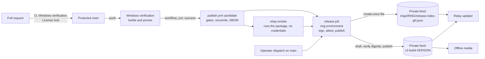

# Releases

How a verified build becomes something a relay or a desktop may install, who may move it
between rings, and how to get back. Issue #280 owns this; the threat entries it answers are
`RISK-UPDATE-CHANNEL-TRUST` and `RISK-RELAY-UPDATE-STATE` in `docs/security/`.

This page separates what the repository implements from what an operator has to configure in
GitHub and on hosts. The second list is not configured today (see
[Controls this repository cannot enforce](#controls-this-repository-cannot-enforce)); nothing
here claims otherwise.

## The shape of it



- **Verification never publishes.** `windows-verify.yml` (owned by #279) builds, tests, launches
  and packages. Its last step hands artifacts to the run; it holds no release credential.
- **Publication never builds.** `publish.yml` accepts only what a successful push-to-main
  verification run produced, and rebuilds nothing.
- **Trust is anchored in a signature, not in the feed.** Every artifact, manifest and ring
  decision is signed keylessly by `publish.yml@refs/heads/main`. A consumer verifies against a
  Sigstore trust root it holds itself. Whoever controls the feed can withhold or delete; they
  cannot produce something a consumer will install.

## Decision: a private GitHub repository as the feed

The v2 feed is a separate private (or internal) GitHub repository chosen per environment through
`V2_RELEASE_REPOSITORY`. The public source repository's Releases page is not a v2 feed, and the
publisher and relay updater both refuse it by name and by visibility.

| Option | Why not |
| --- | --- |
| Keep the public `dev` release | Anonymous, mutable, checksum from the same place as the bytes: exactly `RISK-UPDATE-CHANNEL-TRUST`. |
| Self-host the feed on the relay host (CT 115) | Couples update availability to the thing being updated, puts release storage behind the group's Cloudflare tunnel, and adds a service to operate and patch. |
| Object storage or a CDN | New credentials, new access model and new audit trail to build, for a group of a handful of people. |
| **Private GitHub repository** | Access control with fine-grained, read-only tokens per consumer; commit history as an audit trail of every ring decision; immutable releases for builds; no new infrastructure. |

Consequences accepted with it: GitHub availability is a dependency (offline bundles are the
recovery path); a GitHub account compromise can withhold or delete releases but cannot forge a
signature; consumers need a read-only credential; public-good Sigstore records artifact digests
and the source workflow identity in its transparency log, which is already public information
for a public source repository.

## What a release is

A release is one **signed manifest** (`release-manifest.json`) naming every file with its role,
sha256 and size. It is produced in `publish.yml` by `scripts/release/build_manifest.py` from the
exact artifacts of one verification run, and refuses unless all of these agree:

| Checked | Against |
| --- | --- |
| `update.json` version, commit, run, branch, build time | the selected verification run and its commit on main |
| Portable zip, relay archive, every Velopack file | their checksum files (a Windows runner's `*/d/a/.../dist/…` names included) |
| `BUILD_INFO.txt` inside the package | `update.json` |
| `TarkovCompanion.dll` and `TarkovCompanion.GroupServer.dll` | the informational version `VERSION+COMMIT` compiled into each |
| Velopack full and delta packages, `releases.win.json`, `assets.win.json`, `RELEASES` | package id `TarkovCompanionDesktop`, the release version, and each other's digests and sizes |
| Notices and inventory shipped in the package | `docs/THIRD_PARTY_NOTICES.md` and `docs/THIRD_PARTY_INVENTORY.json` at that commit (line endings aside) |
| Updater script and units shipped in the relay archive | `deploy/group-server/` at that commit, byte for byte |
| The relay's `/health` after extracting the archive | version, commit and relay protocol |
| Database schema, relay protocol, v2 contract, quest exchange | recorded from that commit's source |

Any file in the payload that no checksum file or publisher step accounts for is refused, so
nothing is signed into a release without having been named.

The manifest also carries `feeds.binary`, `feeds.data` and `feeds.model`. Binary, data and model
artifacts share one manifest and one ring decision, so pause, rollback and last-known-good cannot
apply to one and not the others. **No data or model artifact is released today**; those lists
are empty, and adding one means adding it to the verification payload and to the reconciliation
above first.

Delta packages are signed and recorded when verification produces them. It currently produces
full packages only, because generating a delta needs the previous release in Velopack's output
directory and that step belongs to the verification workflow (#279).

Real-payload check, reproducible: the artifacts of verification run
[34910997075](https://github.com/smartpbx/tarkov-companion/actions/runs/34910997075) (1.0.608,
`cbaf3df`) reconcile, and their relay archive answers `/health` as 1.0.608/`cbaf3df`/protocol 1.
That was run on the development host against a clean export of that commit, not in CI.

## Publication, step by step

`publish.yml` has four jobs, holding deliberately different authority.

1. **`request`** (no permissions): resolves a `workflow_run` into *publish to canary*, or
   validates an operator's action, ring and a 1–500 character reason. Inputs reach shell only
   through the environment. Anything not on `refs/heads/main` stops here.
2. **`candidate`** (`actions: read`, `contents: read`, no secrets):
   - requires the triggering run to be `windows-verify.yml`, event `push`, branch `main`, this
     repository, completed successfully, at a commit still reachable from main;
   - requires `ci.yml` to have succeeded for the same commit, waiting up to 40 minutes for it,
     because the Linux suite, dependency audit and secret scan run there and not in Windows
     verification;
   - restores that commit's graph and refuses on any known vulnerable package at release time,
     treating an audit that could not reach its sources as a failure rather than a clean result;
   - requires the locked inventory and third-party notices to match the dependency graph
     (`scripts/audit-licenses.sh`) and runs the secret scan on that commit;
   - reconciles the payload, and generates an SPDX SBOM with Syft 1.51.1 over both archives
     *unpacked*. Measured on run 608's artifacts, the unpacked scan names 86 NuGet packages and
     a scan of the packed archives names none, so an SBOM without NuGet package URLs is refused.
3. **`relay-smoke`** (read-only, no secrets): extracts the relay archive and runs it under an
   emptied environment until `/health` answers as the release. It executes the thing being
   released, so it holds nothing worth stealing.
4. **`release`** (the ring's environment; `id-token: write`, `attestations: write`; the feed
   token only in its final step):
   - downloads the verification artifacts again and re-derives the manifest itself, using the
     SBOM only after its digest matches the candidate's, and the smoke job's observed identity
     only through the manifest builder's own check;
   - signs every artifact and the manifest with cosign 3.1.3 and immediately verifies each with
     the consumer rule;
   - creates SLSA provenance and SBOM attestations for every artifact digest;
   - runs `scripts/release/transition.sh`, below.

### Writing to the feed

`transition.sh` reads the ring, verifies its newest decision, asks `release_policy.py` for the
next one, signs it, packs payload and bundle into one envelope, and verifies that envelope.
Only then does it write:

- **The build**, for `publish`: `v2-build-VERSION` is created as a **draft**, all files and
  bundles are uploaded, GitHub's own sha256 for every asset is compared with the manifest, and
  only then is the draft published and the digests compared again. Nothing names a draft. A
  draft left by an interrupted run is deleted and replaced; a *published* build from an
  interrupted run is adopted only if its manifest verifies and describes the same verified
  bytes, and refused otherwise.
- **The decision**, last: `rings/RING/release-index-gNNNNNNNNNN.json` is created through the
  contents API without a parent blob. Creating a path that already exists is refused, so two
  writers who both read generation N cannot both write N+1. The loser gets a conflict, re-reads,
  recomputes against the winner's decision, re-signs and tries again, up to three times.

Release assets were not used for the decision on purpose: `gh release upload --clobber` deletes
the old asset before uploading its replacement, which is an empty feed for as long as the upload
takes, and for ever if it fails. Old decisions are pruned only after the new one reads back, and
never the newest 200, so pruning cannot move a ring backwards or empty it.

A verified build older than canary's high-water mark is **superseded**: the run reports it and
changes nothing. That is the normal result of two merges verifying out of order.

## Rings

| Ring | Receives | May move to |
| --- | --- | --- |
| canary | every successful protected-main verification | beta, by promotion |
| beta | canary's current signed release | stable, by promotion |
| stable | beta's current signed release | nowhere |

Every transition increments the ring's generation and records the previous generation, the
action, the actor, the reason and the workflow run in the signed decision.

| Action | Effect | Refused when |
| --- | --- | --- |
| `publish` (automatic) | canary serves the new build; the build it replaces becomes last-known-good if none was marked | the ring is paused; the build does not exceed the ring's high-water mark (superseded) |
| `promote` | beta takes canary's release, or stable takes beta's | the source or target is paused; the release does not exceed the target's high-water mark |
| `pause` | consumers hold what they have | already paused |
| `resume` | forward movement allowed again | not paused |
| `mark-lkg` | the current release becomes the rollback target | it already is |
| `rollback` | the ring serves last-known-good and **authorizes the downgrade**; a pause is kept | no last-known-good; already on it |

The high-water mark is the highest version ever published or promoted into the ring. Rollback
does not lower it, so after rolling back from 1.0.610 to 1.0.608, a 1.0.609 that finished
verifying late cannot re-enter; a fix must be newer than the build rolled away from.

A rollback authorization stays on the ring through pause, resume and mark-lkg, and is withdrawn
by the next publish or promotion.

Use **Actions → Publish signed internal release → Run workflow** on `main`, choosing the action,
the ring and a reason. Automatic canary publishes share one concurrency group, so a newer pending
build may replace an older pending one; each operator dispatch has a group of its own, so a
pending pause or rollback is never silently replaced. Correctness does not rely on either.

## Authorization

| Operation | Principal | Human gate | Credential | Enforced by consumers |
| --- | --- | --- | --- | --- |
| Publish to canary | `publish.yml` from a successful push-to-main verification run | `v2-canary-release` environment rules | canary environment's `V2_RELEASE_TOKEN` | signature identity; generation chain; version not below installed unless a signed rollback |
| Promote to beta / stable | operator dispatch of `publish.yml` on main | that ring's environment reviewers | that environment's token | as above, plus the decision must name this feed and ring |
| Pause, resume, mark last-known-good | operator dispatch on main | that ring's environment reviewers | that environment's token | pause holds consumers; generation chain |
| Roll back | operator dispatch on main | that ring's environment reviewers; stable must stay usable in an incident | that environment's token | downgrade only with the signed rollback authorization |
| Read the feed and update a relay | `tarkov-group-update.service`, as root on the host | whoever holds root chooses the ring | read-only token file | everything above, before the service is touched |
| Offline install or recovery | a local operator, or CI invoking the scripts headless | possession of media is not authorization | none; a trust root file | the same signature, digest and downgrade rules |

The matrix names roles, not people. The repository cannot show who GitHub lets act in them;
[capture that](#capturing-evidence) with each release.

## The relay updater

`deploy/group-server/tarkov-group-update.sh` runs from `tarkov-group-update.timer` every half hour
and from the panel's **Update now**. Host configuration lives in
`/etc/tarkov-group/release-feed.env`, loaded by the service unit:

```ini
TARKOV_RELEASE_REPOSITORY=owner/private-feed
TARKOV_RELEASE_RING=stable
TARKOV_RELEASE_TOKEN_FILE=/etc/tarkov-group/release-feed.token
TARKOV_SIGSTORE_TRUST_ROOT=/etc/tarkov-group/sigstore-trusted-root.json
```

The token file holds a fine-grained token with read-only **Contents** on the feed repository and
nothing else, readable by root only. The host needs `gh`, `cosign`, `jq`, `flock`, `tar` and
`wget`.

Every run, in order, before anything on the host changes:

1. takes an exclusive lock, removes the request marker, undoes any swap a killed run left behind;
2. requires the trust root, a private or internal feed that is not the source repository, and
   the token;
3. selects the newest `release-index-g*.json` in `rings/RING`, verifies its signature, and
   requires it to name this feed and ring and to follow from the previous generation;
4. refuses a generation older than one already installed or authenticated for this ring, and a
   second, different decision at an already authenticated generation;
5. downloads the manifest from `v2-build-VERSION`, verifies its signature and that its digest is
   the one the decision names, and that its version, commit and relay protocol agree with it;
6. records `PUBLISHED_*` — what the panel shows as published is only ever something verified;
7. decides: already running it and healthy → record and stop; same version with different bytes
   → refuse; older without a signed rollback → refuse; ring paused → hold (except for a signed
   rollback); refused at this or a later generation before → wait for a new decision;
8. downloads the archive, verifies its signature and digest, refuses links, special files and
   unsafe paths.

Then it installs:

- copies the running tree to `/opt/tarkov-group.lkg` (complete before it replaces the previous
  copy), and writes a **swap journal** under the state directory holding the current units,
  updater and `INSTALLED_*` stamps;
- stops the service, renames the tree aside, renames the new one in, starts the service;
- requires `/health` to report the signed version, commit and protocol;
- installs any changed units and the updater itself from the new build;
- writes `INSTALLED_SHA256`, `_VERSION`, `_COMMIT`, `_RING` and `_GENERATION`, clears
  `REFUSED_SHA256` and `REFUSED_RELEASE.json`, and removes the journal. That removal is the
  commit point.

Any failure after the journal is written — a stop, a rename, the health check, a unit install, a
stamp rename, `SIGTERM` from the unit's 20-minute timeout — restores the previous tree, units,
updater and stamps from the journal, records the refusal with its ring and generation, and
starts the previous relay. A run killed outright is undone by the next run from the same
journal. So the stamps never name a build that did not prove itself, and the tick after a
refusal reports the refusal rather than "already on" (`RISK-RELAY-UPDATE-STATE`).

Generations are per ring. Pointing a host at another ring is a root decision and starts that
ring's history; a downgrade still needs that ring's signed rollback.

`TARKOV_RELEASE_BUNDLE_DIR` replaces the network with a directory holding a ring decision, the
manifest, the relay archive and their bundles; every check above still applies.

### Moving an existing relay onto the signed feed

The relay on CT 115 follows the public `dev` release today, and `windows-verify.yml` (#279) keeps
publishing `dev` until this replacement is running; retiring that job is #279's follow-up once
releases are enabled here. After this merges, the next archive the old updater installs from
`dev` carries this updater, which refuses to run without the configuration above. That relay then
stays on the build it has and says why in its journal until the host is configured: it does not
break, and it does not update. Configure the host before merging if updates must not pause.

Because `publish.yml` follows the whole Windows verification run, a failure in its legacy `dev`
publish job also stops that build from entering canary until the two are separated.

1. Install `gh` and a pinned `cosign` (verify the release checksum) on the host.
2. On a trusted machine: `cosign trusted-root create --with-default-services --out
   sigstore-trusted-root.json`; record its sha256; copy it to the host.
3. Create the read-only feed token; write it to `/etc/tarkov-group/release-feed.token` (mode 0600).
4. Write `release-feed.env`, then `systemctl start tarkov-group-update.service` and read the
   journal. A host whose installed archive matches the ring's release and answers as it is
   adopted without a restart.

### Refreshing the trust root

Sigstore rotates the keys behind public-good signing. A host whose trust root predates a
rotation refuses new signatures and stays on its build, which is the safe failure, and logs
that the signature does not verify. Regenerate the file as in step 2, compare, record and deploy
it. Never fetch it from the feed.

## The desktop

**Not yet moved.** `VelopackUpdateGateway` still reads the public repository's prereleases.
Changing the in-app updater to read the private feed, carry a read credential and apply the same
signature, ring, rollback and last-known-good rules is desktop composition work outside #280; it
belongs to the integration owner (#294). Until then, signed desktop builds reach machines through
the offline path below, and the desktop's in-app update does not enforce anything described here.

The installer still installs per user under `%LOCALAPPDATA%\TarkovCompanionDesktop`, separate
from data under `%LOCALAPPDATA%\TarkovCompanion`; see [WINDOWS.md](WINDOWS.md#release-and-installation).

## Offline installation and recovery

An offline bundle is the files of one `v2-build-VERSION` release, optionally with the ring
decision that selected it:

```bash
gh release download v2-build-1.0.608 --repo owner/private-feed --dir /media/tarkov-1.0.608
scripts/release/verify-offline.sh /media/tarkov-1.0.608 /path/to/sigstore-trusted-root.json
```

On Windows, headless:

```powershell
pwsh -File scripts/release/install-offline.ps1 `
  -BundleDirectory E:\tarkov-1.0.608 `
  -TrustedRoot C:\ProgramData\TarkovCompanion\sigstore-trusted-root.json `
  -Headless
```

Both verify the manifest, every file's digest and signature, and a ring decision if one is on
the media. The installer additionally refuses a version older than the one installed unless
`-AllowDowngrade` is given, and `-WhatIf` performs every check without installing. For a relay,
set `TARKOV_RELEASE_BUNDLE_DIR` as described above.

## Cancellation and failure

| Stage | Interrupted or failing | Left behind |
| --- | --- | --- |
| `request`, `candidate`, `relay-smoke` | job fails | nothing: no job before `release` holds a write credential |
| Signing and attestation | job fails | attestations for artifacts that were never published; harmless |
| Build upload | draft with some assets | an unreferenced draft, replaced by the next attempt |
| Build publication | published build, no decision | adopted by a re-run if it is the same build |
| Decision write | conflict or error | the previous decision, whole; a conflict is retried |
| Pending operator dispatch | cancelled in the Actions UI | nothing changed; dispatch again |
| Relay updater | any step | pre-swap: nothing changed; post-swap: previous build, units and stamps restored |
| Offline scripts | any check | nothing installed |

Re-running a failed publish is always safe: every write is either create-once or checked against
what already exists.

## Controls this repository cannot enforce

`scripts/release/capture_controls.py` reads these from GitHub and records who captured them and
when. It only reads. The state on **2026-09-15T02:07:37Z**, captured by `smartpbx`:

| Control | Required | Observed |
| --- | --- | --- |
| main: force pushes and deletion blocked | neither allowed | met |
| main: verification checks required | `checks`, `windows-verify` among required checks | met (`linux`, `windows-build`, `checks`, `windows-verify`) |
| main: reviewed before merge | at least one approving review | **gap**: no review requirement |
| main: administrators cannot bypass | enforced for administrators | **gap** |
| Default `GITHUB_TOKEN` permission | read | **gap**: write |
| Actions pinned to commit SHAs | required at repository level | **gap**: not required; `ci.yml` and `windows-verify.yml` still use tags (#279) |
| Secret scanning and push protection | enabled | **gap**: disabled |
| Dependency graph | enabled, or the pull-request dependency review cannot run | **gap**: disabled; License lock fails its dependency review step until it is enabled |
| Dependabot vulnerability alerts | enabled | **gap**: disabled |
| `v2-canary-release`, `v2-beta-release`, `v2-stable-release` | exist; main only; beta and stable with reviewers who are not the dispatcher; `V2_RELEASE_TOKEN` and `V2_RELEASE_REPOSITORY` | **gap**: none exist |
| Private feed repository | private or internal, initialized, immutable releases on | **gap**: none configured |

Releases are **off** until the repository variable `V2_RELEASES_ENABLED` is `true`: verified
builds skip `publish.yml` and an operator dispatch fails saying why. Turn it on only after the
environments and feed exist, because a job that names an environment GitHub does not know about
creates it on the spot, with no protection. Each gap above is a setting for the repository owner,
not something to paper over in YAML.

### Capturing evidence

```bash
scripts/release/capture_controls.py --feed-repository owner/private-feed \
  --output release-evidence/controls-$(date -u +%Y%m%dT%H%M%SZ).json
```

Run it with a token that can read repository administration settings; anything it cannot read is
recorded as unreadable, not as met. Keep the output with the release record together with the
publish run URL, the approving reviewer shown on that run, and the signed ring generation. Add
`--require` to make it fail while any control is unmet.

## Verification of this machinery

| What | Where |
| --- | --- |
| Ring policy, envelope, generation selection | `scripts/release/tests/test_release_policy.py` |
| Manifest reconciliation and refusals | `test_build_manifest.py` |
| Feed writes: create-once decisions, races, drafts, digest checks, adoption | `test_feed.py`, `test_transition.py` (end to end through the real scripts with a fake GitHub and a digest-bound fake cosign) |
| Release gates | `test_gates.py` |
| Workflow pinning and trigger policy; pins resolved against GitHub in CI | `test_workflow_policy.py`, `check_workflow_policy.py --verify-tags` |
| Relay updater: every post-swap failure, interrupted swaps, replay, downgrade, pause, rollback, refusal truthfulness | `test_relay_updater.py` |
| Offline verification and the PowerShell installer | `test_offline.py` (PowerShell required in CI) |
| Control capture | `test_capture_controls.py` |
| The verification command against real Sigstore bundles | `scripts/release/test-real-sigstore.sh` |
| Panel reports only authenticated state | `tests/TarkovCompanion.UnitTests/RelayUpdateTests.cs` |

The **License lock** workflow runs all of it, with actionlint, on any pull request touching the
release machinery. `publish.yml` itself cannot run before it is on main, and has not run against
a real feed: the first real publication, and the first signed decision a relay installs, are
still to be observed and recorded.

## Residual risks

- **Freeze.** Whoever controls the feed can stop new decisions reaching consumers. Decisions carry
  a timestamp but no expiry, so a withheld update is detectable by comparing with the Actions
  history, not refused by consumers.
- **Publisher compromise.** Anyone who can change `publish.yml` on main, or approve its
  environments, can sign. Branch protection and environment reviewers are the control, and both
  are gaps today.
- **Tool and action tags in #279's workflows.** `windows-verify.yml` installs `vpk` unpinned and
  uses tag-pinned actions to build what this pipeline signs. Signing proves the bytes are the
  ones verification produced, not that verification's tools were the reviewed ones.
- **Desktop in-app updates** remain on the unauthenticated public feed until #294 moves them.
