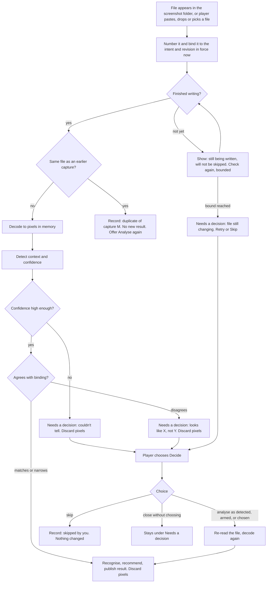

# Capture intent, detected context, and revision conflicts

> **Status: not yet run.** This is the flow the storyboards implement and the sessions test. It is
> a UX specification, not a contract: the capture lifecycle belongs to #264 and #271, and the
> paired-device protocol to #276. Where this needs something they have not defined, it says
> **needs contract**. Nothing here sets a threshold, timeout, or queue size.

## What capture is, and is not

- **The player starts every capture.** They press the game's own screenshot key, paste, drop, or
  choose a file. The companion never presses, synthesises or suppresses any game key, never moves
  the mouse, and never takes a picture of the game on its own.
- **Arming is companion state only.** Choosing "Loot decision" on the desktop or tablet changes what
  the companion will do with the *next* screenshot. It sends nothing to the game.
- **Pixels and files are different things.** The companion reads the screenshot file, decodes it
  into pixels in memory, analyses them, and **discards the decoded pixels** when analysis finishes,
  is skipped, or pauses for a decision. It **does not delete, move, rename or modify the
  screenshot file** the game wrote; that file stays in the EFT screenshot folder. Keeping a decoded
  image for debugging requires Debug Capture, explicitly enabled, with preview, redaction, expiry and
  provenance (#256).
- **Folder cleanup is a separate, opt-in feature.** v1 moves game screenshots older than a day to the
  Recycle Bin by default; #256 §3 makes that opt-in with a preview. Capture copy must never borrow
  cleanup's wording, and cleanup's setting must never be described as "discarding" images.

Copy used on every capture result and in privacy text:

> The screenshot file stays in your EFT folder. The decoded image was discarded after analysis.

## Definitions

| Term | Meaning |
| --- | --- |
| **Armed intent** | What the player said the next screenshot is for: Loot decision, Full stash, Ammo, Keys, Quest items, Map and extracts, Health and character, Flea listings you opened, or Auto-detect (#264 `ScanIntent`). Nothing armed means Auto-detect. |
| **Intent revision** | A number that increases every time any device changes the armed intent. The desktop holds the current revision (#276). |
| **Capture** | One screenshot file, numbered in the order the companion saw it appear. |
| **Binding** | The armed intent and revision in force **when the file appeared**, recorded with the capture. |
| **Detected context** | What analysis thinks the screenshot shows, with a confidence. |
| **Needs a decision** | A capture paused because detection disagreed with the binding or could not tell. It is kept, listed, and announced; it is never dropped or auto-resolved. |

## The flow

### Order of checks

The checks run in this order for every capture, so the same input always gives the same outcome:

1. **Bind.** Record the capture number, observed time, intent, intent revision, and the device that
   set that intent. Filename position parsing happens here and does not wait for anything below
   (#271).
2. **Settle.** Wait until the file has stopped changing and opens for shared reading. Checks are
   bounded (**needs contract**: #271 owns the stability rule and bound; the storyboard uses three
   checks). While waiting, the progress line says the file is still being written and will not be
   skipped. If the bound is reached, the capture goes to Needs a decision with **Retry** and **Skip**.
3. **Duplicate.** If the file's content matches a capture already analysed in this companion session,
   record "Same file as capture M. Not analysed again." with **Analyse again**. A copy under a
   different name is still a duplicate. The duplicate rule compares content, not names (**needs
   contract**: #271 chooses the comparison).
4. **Decode.**
5. **Detect** the context and its confidence.
6. **Unknown.** If confidence is below the threshold (**needs contract**: #264 and #272), the capture
   goes to Needs a decision as "Couldn't tell what capture N shows". This check comes **before** the
   comparison, so a low-confidence guess never produces a mismatch dialog.
7. **Compare** with the binding, using the table below.
8. **Match or narrow:** recognise and publish. **Disagree:** Needs a decision.
9. **Discard pixels** whenever the capture leaves analysis: finished, skipped, or paused. If the player
   later chooses to analyse a paused capture, the companion re-reads the file. If the file has gone
   (the player moved or deleted it), the capture shows "File no longer available" and offers Skip.

### Comparison table

| Armed (binding) | Detected | Outcome |
| --- | --- | --- |
| Auto-detect | anything recognised | **Match** as the detected context. Auto-detect never disagrees. |
| Same as detected | — | **Match** |
| Ammo, Keys or Quest items | Stash grid or loot container grid | **Narrow** (proposal P-02 in [../decision-log.md](../decision-log.md)): analyse the grid and show only that kind, labelled "Ammo from a stash screenshot". If none of that kind is recognised, say so; do not switch intent. |
| Loot decision | Stash grid | **Disagree.** Loot decisions compare against carried inventory; a stash screenshot has none. |
| Full stash | Loot container and carried inventory | **Disagree.** A stash session must not stitch a raid screenshot into the snapshot. The session does not advance. |
| Map and extracts | Anything but an extract list | **Disagree** |
| Health and character | Anything but the character screen | **Disagree** |
| Flea listings you opened | Anything but flea rows | **Disagree** |
| Any intent | Recognised context that is not in the list | **Disagree**, naming what was detected |

### Ordering while a capture waits for a decision

- Captures that belong to an **ordered session** (a Full stash session) wait behind the paused capture
  as unread files: they are settled and bound, but not decoded, so stitching order cannot change and
  no pixels are held.
- Captures that are **independent** (a Loot decision, an item, an extract list) keep analysing and
  publishing in capture order.
- The queue is bounded and overflow is visible, never silent (**needs contract**: #271 owns the bound
  and what happens at it).

## The decision dialog

A disagreement or unknown result is a **background event**: the player is usually in the game when
the screenshot arrives. So:

1. The companion **does not open a dialog and does not move focus**. It adds the capture to Needs a
   decision, updates the Capture area in the header on the desktop and on every paired device
   ("1 capture needs a decision" with a **Decide** button), and announces politely: "Capture 4 needs
   a decision: detected Full stash but Loot decision was armed. Nothing was changed."
2. On Windows, the companion must not bring its window to the foreground for this. Taking focus from
   the game is interference even without input.
3. When the player chooses **Decide**, a modal dialog opens with focus on its **heading**, not on a
   button, so Enter cannot commit a choice they have not read.

| Case | Title | Body | Buttons, in order |
| --- | --- | --- | --- |
| Disagree | "This looks like a stash, not a loot screen" | "Nothing has been changed yet." You armed: Loot decision (rev 19, set on desktop). Detected: Full stash, confidence 0.91. Screenshot 18:43:13; file stays in your EFT folder. | Skip this screenshot · Analyse as Loot decision anyway · **Analyse as Full stash** |
| Unknown | "Couldn't tell what capture 5 shows" | "Nothing in your raid, stash or plan was changed." A choice of contexts, with the armed intent first. | Skip this screenshot · **Analyse as chosen** |
| File still changing | "Couldn't read capture 6 yet" | "The file was still being written when checking stopped." | Skip this screenshot · **Retry** |
| File gone | "Capture 6 is no longer available" | "The file was moved or deleted outside the companion." | **Skip this screenshot** |

- **Escape or closing without choosing** keeps the capture under Needs a decision, and focus returns to
  **Decide** (or to the page heading if no decision remains).
- **No timeout ever chooses.** A decision can wait until the player is out of the raid.
- **Choosing "Analyse as detected" does not change the armed intent.** The next screenshot is still
  bound to what is armed. The result says which intent it was analysed as.
- After a choice, the result or skip is announced politely and listed under recent captures with what
  was decided and on which device.

## Device races and revision conflicts

The desktop is the only place revisions are assigned (#276). Every command carries the revision it
was based on.

| Race | Deterministic outcome | What each device shows |
| --- | --- | --- |
| **Two devices change the armed intent at once.** Tablet sets Ammo based on rev 18; desktop sets Full stash based on rev 18. The tablet's command arrives first. | Tablet's command applies as rev 19. The desktop's command, based on 18, is rejected. Nothing is overwritten. | Desktop (the player's own action was refused, so a dialog is appropriate): "Your capture change was not applied. The tablet changed capture to Ammo (rev 19) before your change to Full stash arrived." Buttons: Keep Ammo · **Arm Full stash now** (a new command based on 19). Assertive announcement. Tablet: polite "Armed: Ammo (rev 19)". |
| **A screenshot appears while an intent change is in flight.** File observed at rev 19; desktop's rev 20 change applies a moment later. | The capture stays bound to rev 19. Analysis starting later does not rebind it. | Result: "Analysed as Ammo, armed when the screenshot appeared." Offer **Analyse again as Full stash**, which re-reads the file. |
| **Both devices resolve the same decision.** | The first choice received for that capture wins. | Second device: "Already decided on tablet: skipped." No second result. |
| **Both devices correct the same result.** Each edit carries the result revision it was based on. | The first correction applies. The second is rejected. | Second device: dialog showing both values and who made each: **Keep theirs** · **Apply mine** (a new command based on the new revision). Never last-writer-wins silently. |
| **Tablet in Control desktop taps a destination after someone at the desktop changed view.** | Tablet's command based on the old revision is rejected. | Tablet: "Desktop changed first. Someone at the desktop switched to Plan · Woods (rev 43). Your change was not applied." Keep desktop view · **Show Prepare on desktop**. Assertive on the tablet only. |
| **Tablet disconnects while a decision is pending.** | The pending decision lives on the desktop. | On reconnect the tablet shows the current list; a choice made on the tablet while offline is not queued for a capture decision (**needs contract**: #276 on which commands may queue offline). |

## Focus and announcement summary

| Event | Focus | Announcement |
| --- | --- | --- |
| Screenshot seen, analysis starts | No change | Polite, once: "Screenshot seen. Analysing as Loot decision." |
| Still being written | No change | None beyond the visible progress line |
| Duplicate | No change | Polite: "Screenshot already analysed as capture 2. No new result." |
| Needs a decision | No change | Polite, naming the capture and the reason |
| Decide | To the dialog heading | Dialog title and description read by the dialog role |
| Close without choosing | Back to Decide | None |
| Result ready | No change | Polite: "Capture 4 result ready: Full stash." |
| Player's own intent change refused | Dialog heading | Assertive: "Capture change conflict. Your change was not applied." |

## Fixtures

These become UXF-CAP fixtures in [acceptance-fixture-map.md](acceptance-fixture-map.md) once the
sessions confirm or change the flow: disagreement queued without focus theft (CAP-01), still writing
never skipped (CAP-02), duplicate produces no second result (CAP-03), unknown never changes state
(CAP-04), stash session does not advance on a rejected capture (CAP-05), intent race rejects the stale
command and binds the capture to the revision in force when the file appeared (CAP-06), and pixels
discarded while the file remains (CAP-07).
