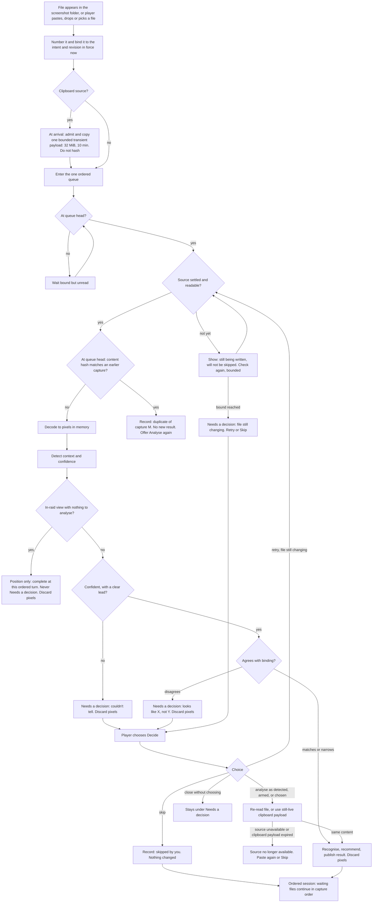

# Capture intent, detected context, and revision conflicts

> **Status: not yet run.** This is the flow the storyboards implement and the sessions test. It is
> a UX specification, not a contract: the capture lifecycle belongs to #264 and #271, and the
> paired-device protocol to #276. Where this needs something they have not defined, it says
> **needs contract**. Nothing here sets a recognition threshold, file-stability rule, or queue size;
> the clipboard payload cap and lifetime are explicit because a paste has no source to re-read.

## What capture is, and is not

- **The player starts every capture.** They press the game's own screenshot key, paste, drop, or
  choose a file, or use a reviewed external OS capture tool (#271 lists all of these as one
  lifecycle). The companion never presses, synthesises or suppresses any game key, never moves
  the mouse, and never takes a picture of the game on its own.
- **Arming is companion state only.** Choosing "Loot decision" on the desktop or tablet changes what
  the companion will do with the *next* screenshot. It sends nothing to the game.
- **Pixels and files are different things.** The companion reads the screenshot file, decodes it
  into pixels in memory, analyses them, and **discards the decoded pixels** when analysis finishes,
  is skipped, or pauses for a decision. It **does not delete, move, rename or modify the
  screenshot file** the game wrote; that file stays in the EFT screenshot folder. Keeping a decoded
  image for debugging requires Debug Capture, explicitly enabled, with preview, redaction, expiry and
  provenance (#256). The only normal-flow exception is the short-lived clipboard payload below: it
  exists solely because clipboard pixels have no file to re-read, is never persisted, and is erased
  as soon as analysis, skip or expiry settles its ordered entry.
- **Folder cleanup is a separate, opt-in feature.** v1 moves game screenshots older than a day to the
  Recycle Bin by default; #256 §3 makes that opt-in with a preview. Capture copy must never borrow
  cleanup's wording, and cleanup's setting must never be described as "discarding" images.
  Cleanup never recycles a file that a pending capture still refers to (**needs contract**: #271),
  otherwise a decision left until after the raid would find its file gone through the companion's
  own doing.

Copy used on every capture result and in privacy text depends on where the capture came from,
because only a game screenshot is in the EFT folder and a pasted image has no file at all:

| Source | Copy |
| --- | --- |
| Game screenshot folder | "The screenshot file stays in your EFT folder. The decoded image was discarded after analysis." |
| Picked or dropped file | "Your file was not changed. The decoded image was discarded after analysis." |
| Clipboard paste or external capture | "The pasted image was held only in memory while this capture waited or was decided, then discarded. It was never saved." |

## Definitions

| Term | Meaning |
| --- | --- |
| **Armed intent** | What the player said the next screenshot is for: Loot decision, Full stash, Ammo, Keys, Quest items, Map and extracts, Health and character, Flea listings you opened, or Auto-detect (#264 `ScanIntent`). Nothing armed means Auto-detect. |
| **Intent revision** | A number that increases every time any device changes the armed intent. The desktop holds the current revision (#276). |
| **Capture** | One screenshot file or pasted image, numbered in the order the companion saw it appear, with its source: game screenshot folder, picked file, dropped file, clipboard, or external capture. |
| **Binding** | The armed intent and revision in force **when the file appeared**, recorded with the capture. "Appeared" means the capture's position in the desktop's single serial event order (file observed, paste or drop received), not the file's creation time or the minute in its name. A revision change and a capture are never simultaneous: whichever the desktop processes first comes first. |
| **Detected context** | What analysis thinks the screenshot shows, with a score. The set of contexts and how each maps to an intent are **needs contract** (#264); today's recognition dispatches only single items, extract lists, mixed containers and flea rows (docs/RECOGNITION.md). The score is a ranking value, not a calibrated probability, so the player never sees it as a bare number. |
| **Needs a decision** | A capture paused because detection disagreed with the binding or could not tell. It is kept, listed, and announced; it is never dropped or auto-resolved. |
| **Clipboard payload** | The one process-owned in-memory byte payload copied at clipboard arrival. It is at most 32 MiB and expires 10 minutes after arrival. It is not a file, thumbnail, cache entry, debug artifact or network payload. |

## The flow

### Order of checks

The checks run in this order for every capture, so the same input always gives the same outcome:

1. **Bind.** In the desktop's serial arrival handler, record the capture number, source, observed
   time, intent, intent revision, device that
   set that intent, and any filename-position candidate. Binding does **not** publish a position:
   a copied or renamed duplicate can have different filename metadata. The candidate waits for its
   ordered duplicate/content validation like every other capture; there is no filename-position fast
   lane.
2. **Admit clipboard bytes at arrival.** Before the entry can wait and before any content hashing, a
   paste or reviewed external capture copies exactly one process-owned transient byte payload,
   capped at **32 MiB** and expiring **10 minutes after arrival**. If the copy exceeds the cap or
   cannot be made, enqueue a visible ordered failure, “Paste was not accepted; paste again with an
   image at most 32 MiB,” and continue only after that entry reaches the head and is recorded. The
   payload never goes to disk, a thumbnail cache, Debug Capture, diagnostics or a paired device. A
   file source stores its reference, not duplicate bytes. Admission validates type/size and obtains
   the bytes; it does **not** decode or content-hash them.
3. **Wait for the ordered turn.** The bound file reference or admitted clipboard payload enters the
   single queue. Nothing below runs until it is the head and no earlier decision blocks it.
4. **Settle at queue head.** For a file, wait until it has stopped changing and opens for shared
   reading. A clipboard payload was made stable by admission, but its expiry/source availability is
   checked again at this turn. File checks are
   bounded (**needs contract**: #271 owns the stability rule and bound; the storyboard uses three
   checks). While waiting, the progress line says the file is still being written and will not be
   skipped. If the bound is reached, the capture goes to Needs a decision with **Retry** and **Skip**.
5. **Content-hash and duplicate-check at queue head.** Only after settlement, compare the source
   content with captures already analysed in this companion session. If it matches,
   record "Same file as capture M. Not analysed again." with **Analyse again**. A copy under a
   different name is still a duplicate. The duplicate rule compares content, not names (**needs
   contract**: #271 chooses the comparison). Neither settlement nor hashing may run while the entry
   is waiting behind an earlier capture.
6. **Decode.**
7. **Detect** the context and its score.
8. **Position only.** After duplicate validation, most game screenshots are ordinary in-raid frames:
   249 of 282 sampled carried
   coordinates, and 13.4% had no HUD at all ([EFT_SCREENSHOT_FACTS.md](../../../research/EFT_SCREENSHOT_FACTS.md)).
   An in-raid view with no grid, list or screen to analyse is recorded as "Position updated; nothing
   else analysed". It completes at its ordered queue turn, is not a mismatch, never enters Needs a
   decision, and does not use up the armed intent
   (proposal P-06; **needs contract**: #264 for the context, #271 for intent consumption). Without
   this, every routine position screenshot would land in Needs a decision. Only here may a validated
   filename-position candidate publish; its observed time is the filename timestamp (minute
   precision), and an older validated position never replaces a newer one.
9. **Unknown.** If the score is below the threshold, or the top two contexts are closer than the
   runner-up margin (**needs contract**: #264 and #272; item recognition today uses a 0.08 lead),
   the capture goes to Needs a decision as "Couldn't tell what capture N shows", offering both
   close contexts first. This check comes **before** the comparison, so a low-confidence guess
   never produces a mismatch dialog.
10. **Compare** with the binding, using the table below.
11. **Match or narrow:** recognise and publish. **Disagree:** Needs a decision.
12. **Discard pixels** whenever the capture finishes or is skipped. A paused file capture is re-read
    if the player later chooses analysis. A paused clipboard capture retains only its bounded
    transient payload until the player decides or its ten-minute deadline; it is then erased. If a
    file is gone/changed or a clipboard payload has expired, the ordered entry visibly says its
    source is unavailable and offers **Paste again** or **Skip**. Expiry never analyses, guesses or
    silently drops a capture: it records that failure at its own queue position, then allows the
    next arrival to start.

### Comparison table

Rows are evaluated **top to bottom and the first match wins**. Any combination not listed is
**Disagree**, naming what was detected. The character screen also shows a stash grid
([EFT_SCREENSHOT_FACTS.md](../../../research/EFT_SCREENSHOT_FACTS.md)); which of the two a
screenshot counts as belongs to the detected-context contract (**needs contract**: #264).

| Armed (binding) | Detected | Outcome |
| --- | --- | --- |
| Auto-detect | anything recognised | **Match** as the detected context. Auto-detect never disagrees. |
| Same as detected | — | **Match** |
| Ammo, Keys or Quest items | Stash grid or loot container grid | **Narrow** (proposal P-02 in [../decision-log.md](../decision-log.md)): analyse the grid and show only that kind, labelled "Ammo from a stash screenshot". If none of that kind is recognised, say so; do not switch intent. Narrowed results inherit the grid's identification limits: stash captions are type codes without a calibre and do not identify a cell uniquely (#272, #283). |
| Loot decision | Stash grid | **Disagree.** Loot decisions compare against carried inventory; a stash screenshot has none. |
| Full stash | Loot container and carried inventory | **Disagree.** A stash session must not stitch a raid screenshot into the snapshot. The session does not advance (#271, #283). |
| Map and extracts | Anything but an extract list | **Disagree** |
| Health and character | Anything but the character screen | **Disagree** |
| Flea listings you opened | Anything but flea rows | **Disagree** |
| Any intent | Recognised context that is not in the list | **Disagree**, naming what was detected |

### One ordered arrival queue

- Every arrival—watched file, picked/dropped file, paste or reviewed external capture—gets its
  number, source, observed time, intent revision and setting device from the desktop's one serial
  arrival order. A clipboard arrival also completes bounded transient-byte admission before it can
  wait; only then does the bound entry enter one queue. There is no independent fast lane.
- Exactly one capture may analyse at a time. If it pauses for an unknown or mismatch decision, it
  remains the head blocker and **all** later captures wait as bound but unread inputs. They are not
  decoded, duplicate-checked or published until the blocker is resolved, so no later result can
  overtake it. A waiting file has no decoded pixels; a waiting clipboard entry alone owns its one
  capped transient payload, because otherwise it could never be read at its turn.
- A clipboard payload expires 10 minutes after its arrival even while an earlier capture blocks the
  queue. When its position reaches the head, the companion records **“Paste expired before analysis;
  paste again”**, erases the payload, announces the failure politely, and starts the next entry. The
  expiry is visible and ordered; it does not permit a later result to overtake it.
- The queue is bounded and overflow is visible, never silent (**needs contract**: #271 owns the bound
  and what happens at it).
- Source settlement and the content hash/duplicate check (steps 4 and 5) do **not** run on a waiting
  file or clipboard payload; they run only when that entry reaches the head (#271, #283). Clipboard
  admission is the deliberate exception: its bounded bytes must be owned at arrival because there
  is no later source to read.
- After the paused capture is analysed or skipped, the next waiting arrival starts. Closing the
  dialog without choosing leaves the same blocker in place.

## The decision dialog

A disagreement or unknown result is a **background event**: the player is usually in the game when
the screenshot arrives. So:

1. The companion **does not open a dialog and does not move focus**. It adds the capture to Needs a
   decision, updates the Capture area in the header on the desktop and on every paired device (#276, #290)
   ("1 capture needs a decision" with a **Decide** button), and announces politely: "Capture 4 needs
   a decision: detected Full stash but Loot decision was armed. Nothing was changed."
2. On Windows, the companion must not bring its window to the foreground for this. Taking focus from
   the game is interference even without input (proposal P-01; #271, #266).
3. When the player chooses **Decide**, a modal dialog opens with focus on its **heading**, not on a
   button, so Enter cannot commit a choice they have not read.

| Case | Title | Body | Buttons, in order |
| --- | --- | --- | --- |
| Disagree | "This looks like a stash, not a loot screen" | "Nothing has been changed yet." You armed: Loot decision (rev 19, set on desktop). Detected: Full stash, a strong match (the wording of match strength is #264's). Screenshot 18:43:13; file stays in your EFT folder. | Skip this screenshot · Analyse as Loot decision anyway · **Analyse as Full stash** |
| Unknown | "Couldn't tell what capture 5 shows" | "Nothing in your raid, stash or plan was changed." A choice of contexts: the two close contexts first when there were two, otherwise the armed intent first. | Skip this screenshot · **Analyse as chosen** |
| Pasted capture, payload live | As above | As above, plus "This pasted image is held only in memory until [exact expiry]. It is never saved." | Skip this screenshot · Analyse as offered above |
| Pasted capture, payload expired | "Paste expired before analysis" | "Nothing was analysed. The temporary in-memory pasted image was discarded at its deadline." | **Paste again** · Skip this capture |
| File still changing | "Couldn't read capture 6 yet" | "The file was still being written when checking stopped." | Skip this screenshot · **Retry** |
| File gone | "Capture 6 is no longer available" | "The file is no longer in its folder, or it has changed since it was captured." | **Skip this screenshot** |

- **Escape or closing without choosing** keeps the capture under Needs a decision, and focus returns to
  **Decide** (or to the page heading if no decision remains).
- **No timeout ever chooses.** A file-backed decision can wait until the player is out of the raid.
  A clipboard decision never chooses either: after its ten-minute payload deadline it becomes the
  visible `Paste expired before analysis` failure and needs a fresh paste, which releases later
  arrivals without retaining pixels indefinitely.
- **Choosing "Analyse as detected" does not change the armed intent.** The next screenshot is bound
  to whatever is armed when it appears, including after any expiry (#271 requires intent to expire
  visibly; whether it expires after one capture is D-01). The result says which intent it was
  analysed as.
- After a choice, the result or skip is announced politely and listed under recent captures with what
  was decided and on which device.

## Device races and revision conflicts

The desktop is the only place revisions are assigned (#276). Every command carries the revision it
was based on.

| Race | Deterministic outcome | What each device shows |
| --- | --- | --- |
| **Two devices change the armed intent at once.** Tablet sets Ammo based on rev 18; desktop sets Full stash based on rev 18. The tablet's command arrives first. | Tablet's command applies as rev 19. The desktop's command, based on 18, is rejected. Nothing is overwritten. | Desktop (the player's own action was refused, so a dialog is appropriate): "Your capture change was not applied. The tablet changed capture to Ammo (rev 19) before your change to Full stash arrived." Buttons: Keep Ammo · **Arm Full stash now** (a new command based on 19). Assertive announcement. Tablet: polite "Armed: Ammo (rev 19)". |
| **A screenshot appears while an intent change is in flight.** File observed at rev 19; desktop's rev 20 change applies a moment later. | The capture stays bound to rev 19. Analysis starting later does not rebind it. | Result: "Analysed as Ammo, armed when the screenshot appeared." Offer **Analyse again as Full stash**, which re-reads the file. |
| **Both devices resolve the same decision.** | The first choice received for that capture wins. | Second device: "Already decided on tablet: skipped." No second result. |
| **Both devices correct the same result.** Each edit carries the result revision it was based on. | The first correction applies. The second is rejected. | Second device: dialog showing both values and who made each: **Keep theirs** · **Apply mine** (a new command based on the new revision). Never last-writer-wins silently. |
| **Tablet in Control desktop taps a destination after someone at the desktop changed view.** | Tablet's command based on the old revision is rejected. | Tablet: "Desktop changed first. Someone at the desktop switched to {destination} · Woods (rev 43). Your change was not applied." Keep desktop view · **Show {tapped destination} on desktop**. Each variant fills in its own labels (A: Plan; B: Prepare). If Keep is chosen in J5, the task remains incomplete and requires a new, measured tap that ends with the named destination confirmed on desktop. Assertive on the tablet only. |
| **Tablet disconnects while a decision is pending.** | The pending decision lives on the desktop. | On reconnect the tablet shows the current list; a choice made on the tablet while offline is not queued for a capture decision (**needs contract**: #276 on which commands may queue offline). |

## Focus and announcement summary

| Event | Focus | Announcement |
| --- | --- | --- |
| Screenshot seen, analysis starts | No change | Polite, once: "Screenshot seen. Analysing as Loot decision." |
| Still being written | No change | None beyond the visible progress line |
| Duplicate | No change | Polite: "Screenshot already analysed as capture 2. No new result." |
| Needs a decision | No change | Polite, naming the capture and the reason |
| Decide | To the dialog heading | Dialog title and description read by the dialog role |
| Close without choosing | Back to Decide | None |
| Result ready | No change | Polite: "Capture 4 result ready: Full stash." |
| Player's own intent change refused | Dialog heading (a refusal that offers choices opens a dialog; one with no alternative keeps focus on the control, see state-matrix.md rule 5) | Assertive: "Capture change conflict. Your change was not applied." |
| Position-only screenshot | No change | None; the position updates visibly |

## Fixtures

These become UXF-CAP fixtures in [acceptance-fixture-map.md](acceptance-fixture-map.md) once the
sessions confirm or change the flow: disagreement queued without focus theft (CAP-01), still writing
never skipped (CAP-02), duplicate produces no second result (CAP-03), renamed duplicate cannot publish a
position and bounded clipboard expiry is visible in queue order (CAP-08), unknown never changes state
(CAP-04), stash session does not advance on a rejected capture (CAP-05), intent race rejects the stale
command and binds the capture to the revision in force when the file appeared (CAP-06), and pixels
discarded while the file remains (CAP-07).
