# System and trust boundaries

Every current-behavior claim below was checked against source at baseline commit `76b506f`.
Planned v2 behavior is explicitly labelled planned; it is never blended into the current diagram.

## Current system and data flow

```mermaid
flowchart TB
    subgraph GameHost["Player's Windows machine — EFT boundary"]
        EFT["Escape from Tarkov\n(process memory, renderer internals, game network — off limits)"]
        Logs["Game-written logs"]
        Shots["Game-written screenshot files\n(filename metadata + image pixels)"]
        Visible["Visible game/window pixels"]
    end

    subgraph Desktop["Desktop trust boundary — same machine and Windows user"]
        Watch["Log/screenshot watchers\nPlatform.Windows/Watching"]
        Capture["User-triggered GDI capture\nPlatform.Windows/Capture"]
        Decode["Screenshot file decoder\nInfrastructure/Recognition"]
        Recognition["OCR + context recognition\nlocal, in-memory pixels"]
        Core["App / Application / Core\nUI, orchestration, domain"]
        Infra["Infrastructure\nSQLite, HTTP, cache, settings"]
        DB[("SQLite: raid history + quest progress")]
        ProfileConfig[("Config/profile.json\nprofile state")]
        GroupConfig[("Config/group.json\nplaintext group key")]
        Secrets[("DPAPI CurrentUser store\nTarkovTracker bearer token")]
        Retention["Default-enabled screenshot cleanup\n24h + recycle bin + keep newest"]
        DesktopUpdate["App/Velopack updater"]
    end

    subgraph UserFiles["User-controlled import/export file boundary"]
        Exchange[("profile + quest JSON\nraid-history JSON/CSV")]
    end

    subgraph External["Public HTTPS services — untrusted content, authenticated transport"]
        TDev["json.tarkov.dev\ncatalog"]
        Hideout["the-hideout maps.json\nmap labels"]
        TTracker["api.tarkovtracker.org\noptional GET /token, GET /progress"]
        GHRelease["GitHub Releases dev channel\nartifacts, feed metadata, checksum files"]
    end

    subgraph RelayHost["Group relay trust boundary — separately operated, internet-facing"]
        Relay["TarkovCompanion.GroupServer\nHTTP origin on 0.0.0.0:8090\noptionally reached through HTTPS tunnel"]
        RelayUpdater["systemd shell updater\ndeploy/group-server/tarkov-group-update.sh"]
        RelayState[("rooms.json + marks.json + reports/*.md\nroom hashes; unbounded mark/report namespaces;\nuntrusted report bodies retained verbatim")]
        AdminKey[["TARKOV_RELAY_ADMIN_KEY\nenvironment + systemd override"]]
    end

    subgraph Peers["Other devices and network actors"]
        Squadmate["Squadmate desktop\nsemi-trusted room member"]
        Tablet["Tablet/phone browser\nsecond screen"]
        AdminBrowser["Operator browser\nadmin page"]
        TabletStore[("browser localStorage\nplaintext group key")]
        Anonymous["Anonymous/LAN/on-path client\nno key, invented key, or HTTP observer"]
    end

    subgraph CI["GitHub Actions — build/release trust boundary"]
        Build["ci.yml / windows-verify.yml\nchecks, tests, packaging"]
        RelayWatch["relay-watch.yml\nrepo token + relay admin key"]
    end

    EFT -. "writes" .-> Logs
    EFT -. "writes" .-> Shots
    EFT -- "ordinary visible output only" --> Visible
    Logs -- "read-only local files" --> Watch
    Shots -- "new-file event + filename position/heading" --> Watch
    Watch --> Core
    Watch -- "screenshot path" --> Decode
    Shots -- "read whole image file" --> Decode
    Shots -- "default: recycle qualifying files older than 24h\nnewest always retained" --> Retention
    Visible -- "user-triggered ordinary GDI capture" --> Capture
    Decode --> Recognition
    Capture --> Recognition
    Recognition -- "result; in-memory capture buffers released" --> Core

    Core --> Infra
    Infra --> DB
    Infra --> ProfileConfig
    Infra --> GroupConfig
    Infra --> Secrets
    Infra <-- "bounded import/export and user-selected paths" --> Exchange
    Infra -- "HTTPS GET, cached" --> TDev
    Infra -- "HTTPS GET, cached" --> Hideout
    Infra -- "canonical-host HTTPS GET; redirects disabled" --> TTracker
    DesktopUpdate -- "Velopack GitHub feed/package flow" --> GHRelease

    GroupConfig -- "plaintext credential loaded by Application" --> Core
    Core -- "X-Group-Key plaintext\nHTTPS or accepted local/LAN HTTP" --> Relay
    Relay -- "hash plaintext in process to 32-hex room id\nstock process does not persist/log plaintext" --> RelayState
    Relay -- "X-Admin-Key; fixed-time comparison" --> AdminKey
    Relay -- "status files + UPDATE_NOW request marker" --> RelayUpdater
    RelayUpdater -- "fetch relay artifact + same-channel checksum" --> GHRelease
    RelayUpdater -- "swap/restart; rollback on failed /health" --> Relay
    Relay <-- "same protocol and reusable group key" --> Squadmate
    TabletStore <--> Tablet
    Tablet -- "same-origin X-Group-Key plaintext;\nHTTPS or HTTP; read state/create/clear marks" --> Relay
    Anonymous -- "public routes, invented rooms/marks on open relay,\nor observe/modify accepted HTTP" --> Relay
    Relay -- "catalog mirror; may serve held stale bytes on fetch failure" --> TDev

    Build --> GHRelease
    Core -- "POST /report; user-submitted SupportBundle body;\ncurrent client redaction incomplete; effective 32 KiB cap;\n3/derived-room/hour counter" --> Relay
    Relay --> RelayState
    RelayWatch -- "X-Admin-Key reads report metadata/references only;\nrepo token opens issues" --> Relay
    AdminBrowser -- "same-origin X-Admin-Key;\nmay be direct HTTP" --> Relay
```

There is deliberately no edge to EFT process memory, renderer internals, game network traffic, or
game-directed input, and there is no in-game overlay node. Visible-pixel capture is the ordinary,
external desktop API path permitted by `docs/SAFETY.md`; it is not a renderer hook.

## Trust boundaries, named

Each boundary is a place identity, integrity, or confidentiality assumptions change. These names
are used in `ABUSE_CASES.md` and `CONTROLS_AND_RESIDUAL_RISK.md`.

### TB-1: EFT visible/file output ↔ Desktop

The desktop is external and read-only toward the game: no process memory, injection, renderer
hooks, EFT traffic inspection/decoding, generated gameplay input, automation, live enemy
tracking, or in-game overlay (`docs/SAFETY.md`, `AGENTS.md`). Current source receives game evidence
through three allowed paths:

1. game-written log lines (`docs/research/EFT_LOG_FACTS.md`);
2. game-written screenshot filename metadata and the screenshot file's decoded pixels
   (`RaidObservationService.cs`, `SkiaScreenshotImageLoader.cs`); and
3. a user-triggered capture of visible window/desktop pixels through ordinary GDI APIs
   (`src/TarkovCompanion.Application/Services/Recognition/ScanUseCase.cs`,
   `GdiScreenCaptureService.cs`).

The latter two converge on the same local recognition pipeline. GDI capture bytes are never
persisted by that source path. The game-written screenshot already exists on disk; the separate
retention service defaults to moving eligible files older than 24 hours to the recycle bin while
always retaining the newest. `ANTI_CHEAT_REVIEW.md` records what current source review and the
lexical audit do—and do not—prove about this boundary.

### TB-2: Local filesystem/browser storage ↔ Desktop process

Logs and screenshots are read as untrusted local inputs. By default, the desktop writes SQLite
raid/quest state, JSON profile/config, cache, and secret files under
`%LOCALAPPDATA%\TarkovCompanion`; `portable.flag` selects install-adjacent `Data`, and application
composition can provide an explicit data-root override.
Screenshot cleanup defaults to enabled with 24-hour retention; it moves only matching game files
to the recycle bin and retains the newest, but an unreadable/missing settings file also selects
that enabled default. The reusable group key is deliberately stored
plaintext in `Config/group.json` (`JsonFileGroupSettingsStore.cs`). The TarkovTracker token is a
different asset stored under DPAPI `CurrentUser` (`WindowsDpapiSecretStore.cs`), which protects
against another Windows user or an offline disk copy, not same-user malware. The two credentials
must not be described as having the same at-rest protection.

### TB-3: Desktop ↔ public catalog/data sources

`json.tarkov.dev`, the-hideout's `maps.json`, and `api.tarkovtracker.org` are external,
untrusted-content sources reached over HTTPS. `TarkovTrackerApiClient` pins the canonical origin,
disables redirects, and issues only `GET /token` and `GET /progress`. Catalog payloads are schema-
checked but are not authenticated against an independent signature or second source.
`TARKOV_COMPANION_OFFLINE=1` substitutes a rejecting HTTP handler.

### TB-4: Desktop/network client ↔ Group relay

Desktop sharing is opt-in and off by default. The desktop and tablet send the reusable group key
as plaintext in `X-Group-Key` (`GroupSessionService.cs`, `Tablet/index.html`). Desktop validation
requires HTTPS for public hosts but explicitly accepts HTTP for loopback, private/link-local
addresses, dotless names, and `.local`/`.internal` names (`GroupSharing.cs`). Tablet and admin
requests inherit whichever scheme served their page. The deployed service binds
`http://0.0.0.0:8090`; a tunnel can add HTTPS on one route, but direct LAN HTTP remains possible.
An on-path LAN actor can therefore read or alter credentials and content when HTTP is used.

Even under HTTPS, `Program.TryReadKey` exposes plaintext to the receiving relay process before
`GroupKey.RoomFor` hashes it. The stock relay intentionally persists only the derived 32-hex room
id, but source behavior cannot make a malicious/compromised receiving process blind to the key.
Both receiver disclosure and cleartext-LAN interception are open under
RISK-RELAY-KEY-DISCLOSURE.

The member payload contains name, map/raid/side, position/height/heading/age, own loadout and
quests when enabled, observed-party details, trail, extracts/transits, and raid-clock fields
(`GroupSessionService.Describe`, `GroupContracts.cs`). The observed-party subset comes from other
players' game-log data and currently crosses the relay despite `docs/SAFETY.md` saying that data
is never transmitted. This document does not relax that rule: it records the mismatch as open
RISK-RELAY-OBSERVED-DATA-POLICY.

An open relay also accepts any syntactically valid invented key as a room selector. That includes
the persistent waypoint namespace: per-room caps do not cap the number of rooms. A closed relay
allowlists derived room hashes, but registration does not prove who supplied a key and does not
make an active room key unguessable.

The same client-to-relay boundary carries problem-report bodies. The relay accepts and persists an
untrusted client-supplied body verbatim, then returns an opaque reference. The client-side bundle
is not reliably redacted today: `Observation.Detail` can carry raw roots, and the app-log tail can
retain roots, screenshot filenames, and coordinates. This contradicts `docs/SAFETY.md`'s
restriction on exporting diagnostic path segments and is open as RISK-REPORT-REDACTION.

### TB-5: Group relay ↔ upstream/self-update

The relay fetches `json.tarkov.dev` catalog bytes, the-hideout landmark names, and GitHub release
assets. A desktop client that cannot reach the mirror falls back to upstream. The relay behaves
differently when it already holds an expired catalog snapshot: if refresh fails or returns an
invalid shape, `CatalogMirror.GetAsync` returns the held snapshot silently. Only a failure with no
held snapshot becomes 503. The payload ETag is a hash of received bytes, proving identity and
mirror/client consistency—not upstream authenticity or freshness.

The deployed `deploy/group-server/tarkov-group-update.sh` verifies an artifact against a checksum
fetched from the same GitHub release, swaps files, rolls back on failed `/health`, and records a
refused build. `RelayUpdate.cs` is the status/request adapter: it reads checksum/status files and
writes `UPDATE_NOW`; it does not perform the swap. Current source has no independently anchored
signature or relay-side minimum-version state.

### TB-6: Player ↔ Squadmate via relay

Every member field is client-reported. The relay performs shape/count validation but does not
cross-check gameplay truth. Identity is a display name with no cryptographic binding; publishing
again under the same name replaces the prior entry. Members share the same reusable room
credential, and marks are ownerless by design. The 60-waypoint/30-ping limits are per room. On an
open relay, rotating invented keys creates unbounded `GroupMarks` room entries and persistent
waypoint sets; every waypoint mutation serializes all non-empty rooms. The seven-day waypoint
filter is applied on load/restart, not as a live TTL.

### TB-7: Player ↔ Tablet via relay

The tablet stores the same reusable group key in browser `localStorage`, sends it on every request,
and has no separate identity or scope. Fetch uses the page's origin, so a tablet opened through
direct HTTP also sends the key and room content without transport confidentiality or integrity.
It can read room state and create, complete, remove, or clear marks. There is no per-device
revocation; rotation changes the credential for all members.
`/catalog`, `/landmarks`, and `/search` require no key because they serve public game data.

### TB-8: Relay operator ↔ Relay

`TARKOV_RELAY_ADMIN_KEY` is separate from group keys and is compared with
`CryptographicOperations.FixedTimeEquals` (`RelayAdmin.cs`). `GET /admin` is intentionally an
unauthenticated, secret-free HTML shell: it contains no configured key or protected relay data,
and it cannot perform an administrative action without a key supplied by the browser. The keyed
operator APIs — `/admin/rooms`, `/admin/update`, `/reports`, and `/reports/{reference}` — enforce
authorization; missing configuration refuses access to those APIs. The shell keeps a supplied key
in tab-scoped `sessionStorage` and sends it to the same origin; a direct HTTP origin exposes it to
an on-path LAN actor just like a group key.
The expected operator is trusted for administration; ACT-11 separately models a malicious,
compelled, or compromised operator/process with host/request-processing access.

### TB-9: Relay ↔ GitHub Actions problem-report flow

For a report body accepted under TB-4, report-body access belongs to the keyed operator boundary
TB-8, not Actions. `relay-watch.yml` uses the relay admin key only to list report reference, size,
and received time,
then uses the GitHub-provisioned repository token to open an issue containing that metadata. It
never fetches a report body, and the relay itself holds no GitHub credential. The current
three-per-derived-room/hour counter does not bound relay-wide abuse on an open relay: an anonymous
caller can choose a new acceptable key, and therefore a fresh room bucket, repeatedly. Stored
report files have no global count, TTL, or disk quota; RISK-REPORT-RATE-LIMIT is therefore open.

### TB-10: Build/release ↔ published and installed artifact

`windows-verify.yml` builds/tests and performs its Windows launch/page-gallery gate before its
publish job can update the rolling release; pull requests cannot publish. It emits release
artifacts and checksum files.

The two consumers are not the same implementation. The deployed
`deploy/group-server/tarkov-group-update.sh` downloads the relay checksum/archive, verifies the
archive, swaps it, and health-checks/rolls back; `RelayUpdate.cs` exposes status and requests that
external updater. `VelopackUpdateGateway.cs` is in the App project and delegates the desktop's
GitHub feed, package download, and application to Velopack; current project source does not
explicitly consume `VELOPACK-SHA256SUMS.txt`. This baseline records the dependency on Velopack and
the release channel without inventing an independent desktop verification step not observed in
source. Both consumers still depend on the integrity and freshness of one release channel.

### TB-11: User-controlled import/export files ↔ Desktop

Current source already exposes several serialization boundaries. `JsonFilePlayerProfileService`
stores profile state in `Config/profile.json` and can import/export a bounded versioned JSON
envelope. `ProjectQuestProgressJson` reads/writes bounded quest-progress JSON with a canonical
payload checksum; `QuestProgressExchangeService` previews changes before confirmation.
`SqliteRaidHistoryService`, reached through `RaidHistoryOutbox`, can export raid history as JSON
or CSV. These are current source surfaces even where a specific UI entry point is limited.

Size/schema checks, atomic writes, canonical checksums, and preview/confirm reduce accidental
damage. A checksum carried inside an untrusted document proves internal consistency, not author
identity, and profile import does not establish that an otherwise-valid envelope is newer than
current state. Full replay/schema/CSV-formula and export-minimization review remains open as
RISK-LOCAL-IMPORT-EXPORT-INTEGRITY; #315 is a planned expansion, not the first export boundary.

## Baseline source anchors

Line numbers below are for baseline commit `76b506f`; symbols are the durable locator if later
edits move them.

| Behavior | Reviewed source anchor |
| --- | --- |
| Screenshot-file decode | `src/TarkovCompanion.Application/Services/Raids/RaidObservationService.cs:510`; `src/TarkovCompanion.Infrastructure/Recognition/SkiaScreenshotImageLoader.cs:31-77` |
| User-triggered visible-pixel capture | `src/TarkovCompanion.Application/Services/Recognition/ScanUseCase.cs:61-150`; `src/TarkovCompanion.Platform.Windows/Capture/GdiScreenCaptureService.cs:9-118` |
| Default screenshot retention | `src/TarkovCompanion.Application/Services/Raids/ScreenshotRetention.cs:10-24,80-130`; `src/TarkovCompanion.Infrastructure/Settings/JsonFileScreenshotRetentionStore.cs:27-35,61-80` |
| Desktop plaintext group-key persistence | `src/TarkovCompanion.Infrastructure/Settings/JsonFileGroupSettingsStore.cs:7-17,62-83` |
| Accepted group transports / deployed HTTP origin | `src/TarkovCompanion.Application/Services/Group/GroupSharing.cs:55-109`; `deploy/group-server/tarkov-group.service:19-21` |
| Desktop/tablet plaintext group-key requests | `src/TarkovCompanion.Application/Services/Group/GroupSessionService.cs:213-221`; `src/TarkovCompanion.GroupServer/Tablet/index.html:125-173,690-719` |
| Public admin shell / protected keyed operator APIs | `src/TarkovCompanion.GroupServer/Program.cs:536-541,547-557,580-588,623-631,647-656,667-674`; `src/TarkovCompanion.GroupServer/RelayAdmin.cs:24-40` |
| Admin same-origin credential request | `src/TarkovCompanion.GroupServer/Admin/index.html:115-121,163-166` |
| Relay plaintext parse then room hash | `src/TarkovCompanion.GroupServer/Program.cs:725-740`; `src/TarkovCompanion.GroupServer/GroupKey.cs:57-61` |
| Full outgoing group-state shape | `src/TarkovCompanion.Application/Services/Group/GroupSessionService.cs:553-598`; `src/TarkovCompanion.GroupServer/GroupContracts.cs:27-37,145-180` |
| Log-derived observed-party payload | `src/TarkovCompanion.Application/Services/Group/GroupKitShare.cs:25-35`; `src/TarkovCompanion.Application/Services/Group/GroupKitMirror.cs:38-119`; `src/TarkovCompanion.Application/Services/Group/GroupSessionService.cs:377-391` |
| Silent stale catalog fallback | `src/TarkovCompanion.GroupServer/CatalogMirror.cs:151-157,184-206`; `src/TarkovCompanion.GroupServer/Program.cs:484-513` |
| Desktop update adapter | `src/TarkovCompanion.App/Services/Updates/VelopackUpdateGateway.cs:32-75,95-150` |
| Relay update status versus deployed updater | `src/TarkovCompanion.GroupServer/RelayUpdate.cs:68-103`; `deploy/group-server/tarkov-group-update.sh:101-179` |
| Data-root selection | `src/TarkovCompanion.App/Services/AppDataPaths.cs:12-27`; `src/TarkovCompanion.App/Services/AppComposition.cs:50-72` |
| Report bundle, redaction gap, rate/storage bounds | `src/TarkovCompanion.App/Services/Diagnostics/SupportBundle.cs:48-110`; `src/TarkovCompanion.Application/Services/Raids/RaidObservationService.cs`; `src/TarkovCompanion.App/Services/FileLoggerProvider.cs`; `src/TarkovCompanion.GroupServer/Program.cs:10-12,252-283`; `src/TarkovCompanion.GroupServer/ProblemReports.cs:31-60,101-193`; `.github/workflows/relay-watch.yml` |
| Relay member expiry | `src/TarkovCompanion.GroupServer/GroupRooms.cs:29,130-205`; `src/TarkovCompanion.GroupServer/Program.cs:132-148` |
| Cross-room mark persistence | `src/TarkovCompanion.GroupServer/GroupMarks.cs:67-77,102-140,243-315` |
| Profile/import/export surfaces | `src/TarkovCompanion.App/Services/AppComposition.cs:84-85,244-249`; `src/TarkovCompanion.Infrastructure/Profile/JsonFilePlayerProfileService.cs:89-119`; `src/TarkovCompanion.Infrastructure/Profile/ProjectQuestProgressJson.cs:16-180`; `src/TarkovCompanion.Infrastructure/Persistence/Repositories/SqliteRaidHistoryService.cs:333-364`; `src/TarkovCompanion.Application/Services/Runtime/RaidHistoryOutbox.cs:119-123` |
| Lexical anti-cheat audit | `scripts/audit-safety.sh:5-33` |

## Data classification quick reference

See `ASSETS_AND_ACTORS.md` for the full asset taxonomy.

| Boundary | Confidentiality | Integrity | Availability |
| --- | --- | --- | --- |
| TB-1 EFT output ↔ Desktop | Personal visible/file evidence | Critical — false evidence must never be presented as fact | Low |
| TB-2 Storage ↔ Desktop | High — plaintext group key plus DPAPI token and local history | High | Low |
| TB-3 Desktop ↔ public data | Low public catalog / Medium TarkovTracker token | Medium | Medium |
| TB-4 Client ↔ Relay | High — reusable group key and room state | High | Medium |
| TB-5 Relay ↔ upstream/update | Low catalog confidentiality | High | Medium |
| TB-6 Player ↔ Squadmate | Medium | Medium | Low |
| TB-7 Player ↔ Tablet | High — reusable group key in browser storage | Medium | Low |
| TB-8 Operator ↔ Relay | High — admin key and all retained reports | High | Medium |
| TB-9 Relay ↔ Actions | Low — report reference, size, and received time only | Medium | Medium — unbounded retained queue today |
| TB-10 Build/release ↔ artifact | Low | Critical — supply chain | Medium |
| TB-11 Import/export files ↔ Desktop | Personal profile/quest/raid content | Medium — stale or attacker-authored state | Low |
