# System and trust boundaries

Every component below was confirmed against source at the time of writing. Where a citation gives
a file path, that path is what this diagram is drawn from.

## System overview

```mermaid
flowchart TB
    subgraph GameHost["Player's Windows machine — EFT trust boundary (never crossed)"]
        EFT["Escape from Tarkov\n(process memory, renderer, network — off limits)"]
        Logs["Game logs\n(application, output, backend, push-notifications)"]
        Shots["Screenshot folder\n(filename carries position/heading)"]
    end

    subgraph Desktop["Desktop trust boundary — TarkovCompanion.Desktop, same machine, same user"]
        Watch["Log/screenshot watchers\n(Platform.Windows/Watching)"]
        Core["Core / Application\n(domain, use cases, no I/O)"]
        Infra["Infrastructure\n(SQLite, HTTP, OCR, cache)"]
        DB[("SQLite: profile, raid history,\nquest progress")]
        Secrets[("DPAPI CurrentUser store\nTarkovTracker bearer token")]
        Recognition["Windows OCR / Tesseract\n(local only, capture bytes discarded by default)"]
    end

    subgraph External["Public HTTPS data sources — untrusted content, trusted transport"]
        TDev["json.tarkov.dev\ncatalog"]
        Hideout["the-hideout maps.json\nmap labels"]
        TTracker["api.tarkovtracker.org\noptional token-gated GET /token, GET /progress"]
        GHRelease["GitHub Releases\n(dev channel: app + relay artifacts + SHA256SUMS)"]
    end

    subgraph RelayHost["Group relay trust boundary — separate host, Proxmox CT 115, internet-facing"]
        Relay["TarkovCompanion.GroupServer\n(ASP.NET minimal API)"]
        RelayState[("State dir: rooms.json, marks.json,\nreports/*.md — survives self-update")]
        AdminKey[["TARKOV_RELAY_ADMIN_KEY\nenv + systemd override file"]]
    end

    subgraph Peers["Other players' machines — semi-trusted peers, same room only"]
        Squadmate["Squadmate's desktop client"]
        Tablet["Tablet / phone browser\n(second screen, holds the group key)"]
    end

    subgraph CI["GitHub Actions — build/release trust boundary"]
        Build["ci.yml / windows-verify.yml\n(audit-safety.sh, scan-secrets.sh, tests)"]
        RelayWatch["relay-watch.yml\n(repo-scoped Actions token, files issues)"]
    end

    Logs -- "read-only, local" --> Watch
    Shots -- "read-only, local, filename only" --> Watch
    Watch --> Core
    Core --> Infra
    Infra --> DB
    Infra --> Secrets
    Infra --> Recognition
    Infra -- "HTTPS GET, cached" --> TDev
    Infra -- "HTTPS GET, cached" --> Hideout
    Infra -- "HTTPS GET /token, /progress\nno redirects, canonical host only" --> TTracker
    Infra -- "checksum-verified self-update" --> GHRelease

    Infra -- "X-Group-Key: hash of shared secret\nopt-in, off by default" --> Relay
    Relay -- "room = SHA-256(key)[..32]\nno plaintext key stored" --> RelayState
    Relay -- "X-Admin-Key, fixed-time compare" --> AdminKey
    Relay -- "self-update: fetch SUMS, verify\nchecksum, swap, rollback on\nfailed /health" --> GHRelease
    Relay <-- "same protocol, same group key" --> Squadmate
    Tablet -- "group key, read-only except marks" --> Relay
    Relay -- "/catalog /landmarks /search\nno key, public game data" --> Tablet

    Build --> GHRelease
    Relay -- "POST /report: redacted body,\nrate-limited 3/room/hour, 64KB cap" --> RelayState
    RelayWatch -- "reads report references,\nrepo Actions token only" --> RelayState
```

## Trust boundaries, named

Each boundary is a place identity, integrity, or confidentiality assumptions change. The
boundary's *name* is used consistently across `ABUSE_CASES.md` and
`CONTROLS_AND_RESIDUAL_RISK.md`.

### TB-1: EFT ↔ Desktop

The project's foundational boundary. The desktop application is external and read-only toward
the game: no process memory access, no injection, no renderer hooks, no traffic interception, no
input synthesis (`docs/SAFETY.md`, `AGENTS.md`). Everything the desktop learns about the game
crosses this boundary as one of exactly two evidence sources: game-written log lines
(`docs/research/EFT_LOG_FACTS.md`) and game-written screenshot filenames/pixels
(`docs/research/EFT_SCREENSHOT_FACTS.md`). See `ANTI_CHEAT_REVIEW.md` for the full review of this
boundary; it is not re-litigated per abuse case here.

### TB-2: Local filesystem ↔ Desktop process

Game logs and screenshots are read-only inputs; the desktop writes only its own SQLite database,
config, cache, and DPAPI secret files under `%LOCALAPPDATA%\TarkovCompanion` (`docs/OPERATIONS.md`),
and moves stale screenshots to the recycle bin only when that feature is explicitly enabled
(`docs/SAFETY.md`, "Do not persist captured screen images unless Debug Capture is explicitly
enabled" in `AGENTS.md`). Within this same-user, same-machine boundary, `Secrets/` is DPAPI
`CurrentUser`-scoped (`WindowsDpapiSecretStore.cs`) — it protects against a different Windows
user or an offline copy of the disk, not against malware running as the same user, which is a
named residual risk (`CONTROLS_AND_RESIDUAL_RISK.md`, RISK-DPAPI-SAMEUSER).

### TB-3: Desktop ↔ public catalog/data sources

`json.tarkov.dev` (item/quest/map/trader catalog), the-hideout's `maps.json` (map labels), and
`api.tarkovtracker.org` (optional, user-initiated token import) are all external, untrusted-content
sources reached over HTTPS. `TarkovTrackerApiClient` pins the canonical origin, disables redirects,
and only ever issues `GET /token` and `GET /progress` (`TarkovTrackerApiClient.cs`,
`docs/SAFETY.md`). `TARKOV_COMPANION_OFFLINE=1` substitutes a rejecting handler entirely
(`docs/ARCHITECTURE.md`).

### TB-4: Desktop ↔ Group relay

Opt-in and off by default. Crossed only when the player turns sharing on and types a group key.
The key never travels in a form the relay can recover — the relay hashes it into a room identifier
and never stores or logs the key itself (`GroupKey.cs`). This boundary is bidirectional: the
desktop both publishes its own state (`POST /state`) and receives every other member's state,
each member's own client-reported and unverified.

### TB-5: Group relay ↔ upstream/self-update

The relay is itself a client of `json.tarkov.dev` (catalog mirror), the-hideout (landmark names),
and GitHub Releases (self-update). The mirror never becomes a dependency: a client that cannot
reach the relay falls back to fetching upstream directly, and a relay that cannot reach upstream
says so rather than serving stale data silently (`CatalogMirror.cs`, `docs/GROUP_RELAY.md`). The
relay's own self-update verifies a checksum fetched from the same release the updater trusts,
rolls back on a failed `/health`, and records the refusal so it is not retried until a newer build
is published (`RelayUpdate.cs`, `docs/OPERATIONS.md`).

### TB-6: Player ↔ Squadmate (via relay)

Every field in a `POST /state` body is client-reported and the relay performs no cross-checking
against another member's claim (`docs/GROUP_RELAY.md`, `GroupContracts.cs`). Identity within a
room is a display name with no cryptographic binding: "publishing again under the same name
replaces your previous entry rather than adding a second one" is stated as intended behavior in
`docs/GROUP_RELAY.md`, and is also the mechanism behind ABUSE-RELAY-NAME-COLLISION.

### TB-7: Player ↔ Tablet (via relay)

The tablet is a browser client holding the same group key as every other member, with no separate
identity or scope — it can read the same `/state` room, drop and clear the same marks as a
desktop member, per `docs/GROUP_RELAY.md` and `Tablet.cs`. `/catalog`, `/landmarks`, and `/search`
require no key at all, by design, because they serve only public game data (`RelayAccess.cs`,
`IsGroupPath`).

### TB-8: Relay operator ↔ Relay

A separate secret from the group key (`TARKOV_RELAY_ADMIN_KEY`), compared in fixed time
(`RelayAdmin.cs`), gates `/admin`, `/admin/rooms`, `/admin/update`, and `/reports/{reference}`.
Configuration absence refuses rather than allows (`RelayAdmin.IsAuthorised` returns `false` when
`Secret` is unset).

### TB-9: Relay ↔ GitHub Actions (problem reports)

The relay holds no GitHub credential. It stores redacted report bodies locally and hands back an
opaque reference; the hourly `relay-watch.yml` workflow reads references and opens issues using
the token GitHub Actions already provisions for its own repository (`docs/OPERATIONS.md`,
`ProblemReports.cs`). This is a deliberate inversion of the usual pattern — the
internet-facing box is the one with no write credential to the thing it feeds.

### TB-10: Build/release ↔ published artifact

`windows-verify.yml` gates publishing: only a build that launched on a real Windows runner and
photographed every page is ever published, and the publish job holds the only write token, does
not run for pull requests, never deletes a release, and refuses to publish a version below what is
already live (`README.md`, `docs/OPERATIONS.md`). Both the desktop updater and the relay updater
trust this channel exclusively.

## Data classification quick reference

See `ASSETS_AND_ACTORS.md` for the full asset taxonomy; this is the classification each boundary
above carries, for cross-reference while reading abuse cases.

| Boundary | Confidentiality | Integrity | Availability |
| --- | --- | --- | --- |
| TB-1 EFT ↔ Desktop | N/A (read-only egress from game) | Critical — false evidence must never be presented as fact | N/A |
| TB-2 Filesystem ↔ Desktop | High (local secrets, other players' logged data) | High (own raid history) | Low |
| TB-3 Desktop ↔ public data | Low (public catalog) / Medium (TarkovTracker token) | Medium (catalog trusted for gameplay decisions) | Medium (offline mode exists) |
| TB-4 Desktop ↔ Relay | Medium (position/loadout shared only with own group) | Medium (misleading a squadmate) | Low (relay is an optimization, not a dependency) |
| TB-5 Relay ↔ upstream/self-update | Low | High (a compromised update reaches every relay user) | Medium |
| TB-6 Player ↔ Squadmate | Medium | Medium (spoofable identity within a room) | Low |
| TB-7 Player ↔ Tablet | Medium (group key shared to another device) | Low | Low |
| TB-8 Operator ↔ Relay | High (admin key scope: every group's reports) | High | Medium |
| TB-9 Relay ↔ Actions | Medium (report contents describe a player's machine) | Low | Low |
| TB-10 Build ↔ artifact | Low | Critical (supply chain) | Medium |
